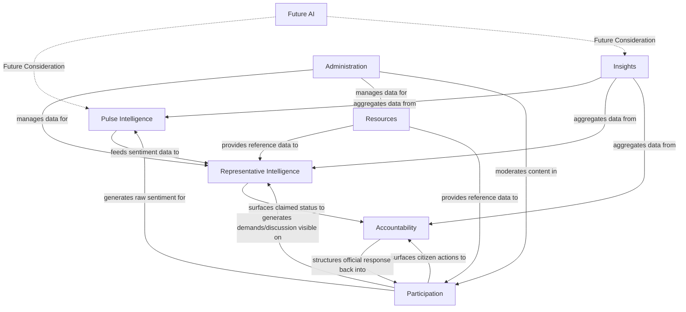
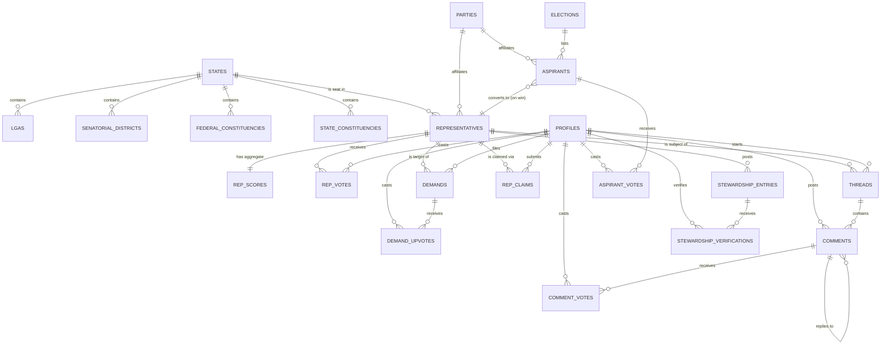
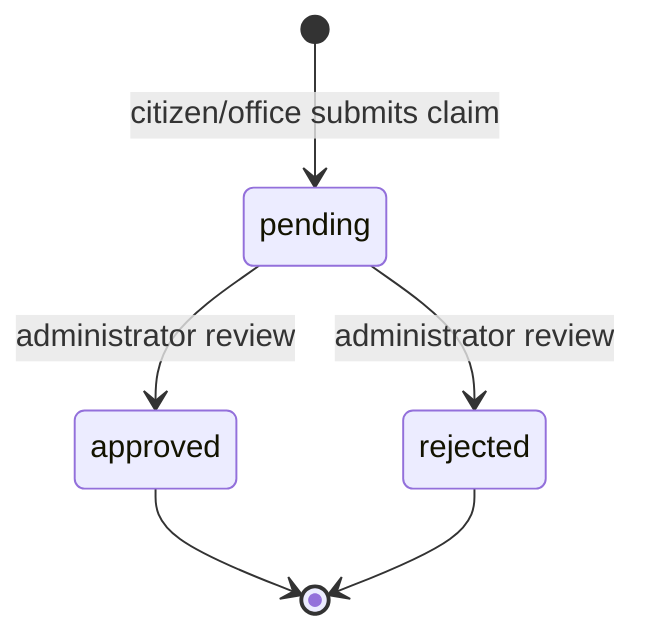
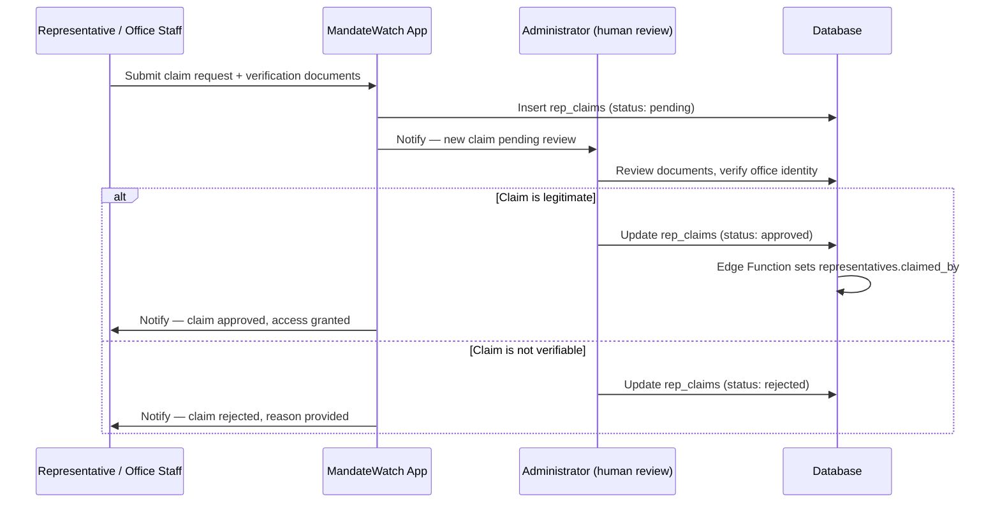
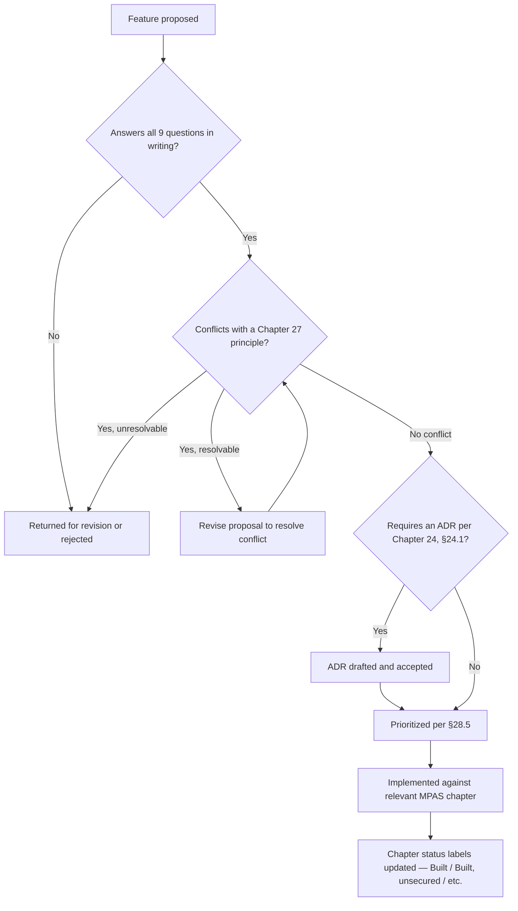

# MandateWatch Product Architecture Specification (MPAS) v2.0

> **See `RECONCILIATION-NOTE.md` in this directory before treating this document's "current state"
> claims as accurate.** It was written against the original client-only prototype; this session
> shipped a real backend, real auth, real routing, and real admin/claim security since. `CLAUDE.md`
> at the repo root is the authoritative, continuously-updated record of what's actually built.

**Status:** Complete and ratified — Chapters 1–38 (see Ratification Statement at document end for conditions attached to this ratification, including two launch-blocking risks and four unresolved legal-instrument gaps).
**Document owner:** MandateWatch founding team
**Intended location:** `/docs/architecture/MPAS-v2.md`
**Supersedes:** MPAS v1.0 (outline only)
**Companion documents:** `mandatewatch-prd.md` (product rationale), `mandatewatch-backend-plan.md` (schema and build order, treated as authoritative for Chapters 9–10 until reconciled here)

---

## Table of Contents

*Full document map. Chapters delivered in this part are marked **[This Part]**; others will be filled in sequentially and this table re-issued unchanged in structure.*

1. Executive Summary **[Delivered]**
2. Product Strategy **[Delivered]**
3. Platform Philosophy **[Delivered]**
4. Product Ecosystem **[Delivered]**
5. Information Architecture **[Delivered]**
6. Navigation Architecture **[Delivered]**
7. User Types **[Delivered]**
8. User Journeys **[Delivered]**
9. Domain Model **[Delivered]**
10. Database Architecture **[Delivered]**
11. API Architecture **[Delivered]**
12. Search Architecture **[Delivered]**
13. Pulse Intelligence **[Delivered]**
14. Representative Intelligence **[Delivered]**
15. Participation **[Delivered]**
16. Accountability **[Delivered]**
17. Insights **[Delivered]**
18. Administration **[Delivered]**
19. Design System **[Delivered]**
20. Engineering Standards **[Delivered]**
21. Infrastructure **[Delivered]**
22. International Expansion **[Delivered]**
23. AI Strategy **[Delivered]**
24. Governance **[Delivered]**
25. Risks & Technical Debt **[Delivered]**
26. Appendix **[Delivered]**

**Second Review Cycle (Architecture Review Board additions):**

27. Product Principles **[Delivered]**
28. Product Decision Framework **[Delivered]**
29. Data Governance **[Delivered]**
30. Platform Health & Success Metrics **[Delivered]**
31. Event Taxonomy **[Delivered]**
32. Design Governance **[Delivered]**
33. Platform Operations **[Delivered]**
34. Business Architecture **[Delivered]**
35. Platform Economics **[Delivered]**
36. Five-Year Strategic Roadmap **[Delivered]**
37. Final Board Review **[Delivered]**
38. Appendix II — Second Review Cycle Additions **[Delivered]**

**Architecture Review Addendum (Chapters 27+, appended — see note preceding Chapter 27):**

27. Product Principles **[Delivered]**
28. Product Decision Framework **[Delivered]**
29. Data Governance
30. Platform Health & Success Metrics
31. Event Taxonomy
32. Design Governance
33. Platform Operations
34. Business Architecture
35. Platform Economics
36. Five-Year Strategic Roadmap
37. Final Board Review & Ratification Record

---

## A note on how to read this document

This specification is written at two altitudes, and it is important to keep them distinct throughout every chapter:

- **What is real today**: MandateWatch has a working, browser-based interactive prototype covering four citizen-facing modules (Representative directory, Election Watch, Demands Board, Discussion) plus an internal Admin data-entry tool. It carries real data for 354 of Nigeria's ~1,500 Phase 1 elected officials (governors, senators, House of Representatives members), a complete 774-LGA reference dataset, and INEC delimitation data mapping LGAs to senatorial districts and federal constituencies. It has no backend, no authentication beyond a simulated flow, and no deployed production instance as of this writing.
- **What is specified for the future**: sections describing multi-country abstraction, GraphQL, semantic search, AI recommendation systems, and a seven-role permission matrix describe target-state architecture, not built systems. Every such section is explicitly labeled **Future Consideration** or **Non-Goal (Current Phase)**. Treat unlabeled sections as either already built or immediately buildable from the current codebase.

This distinction is the single most important governance rule in this document. An architecture specification that does not distinguish "exists" from "planned" from "aspirational" is not a specification — it is a wish list wearing a specification's formatting. Every chapter in this document is required to maintain this distinction explicitly.

---

# Chapter 1: Executive Summary

### 1.1 Mission

Building the Infrastructure for Accountable Democracy.

MandateWatch exists to close the gap between an election and the next one — the multi-year period during which an elected official's only obligation is, in practice, to appear at the next campaign. The platform's function is to make that gap visible, continuously, at the level of the individual mandate: this senator, this governor, this constituency, this promise.

### 1.2 Vision

Within a decade, no elected official in a market MandateWatch serves should be able to assume that their term in office goes unobserved between elections. The platform's long-run success condition is not traffic or revenue — it is that "checking MandateWatch" becomes as routine a civic habit as checking a weather app, in the specific sense that citizens reach for it to answer a factual question ("has my rep done anything?") rather than to consume political commentary.

### 1.3 Core Principles

| # | Principle | What it means in practice |
|---|---|---|
| 1 | **Sentiment is citizen-generated, never fabricated** | Approval ratings, "felt presence" scores, and demand counts start at neutral defaults for every official and move only through real user interaction. The platform never simulates public opinion to make a page look more populated than it is. |
| 2 | **Identity data is sourced, not invented** | A representative's name, party, constituency, and term dates must trace to an identifiable public record (INEC, National Assembly, state government publication). Where data is incomplete, the gap is shown as a gap, not filled with a plausible guess. |
| 3 | **Partisan neutrality is structural, not aspirational** | Every official, regardless of party, is subject to identical data fields, identical scoring mechanisms, and identical UI treatment. The platform's credibility depends on this being verifiably true in the codebase, not merely stated in a mission paragraph. |
| 4 | **Verification is earned, not granted by default** | An official's profile carries no special status until that office actively claims and verifies it through a defined process. Absence of verification is the default, honest state — not an error condition. |
| 5 | **The platform documents; it does not adjudicate** | MandateWatch records what citizens report and what officials claim. It is not positioned as a fact-checking authority and does not represent demand or discussion content as verified fact. |

### 1.4 Strategic Goals (18-month horizon)

1. Reach data completeness for all Phase 1 national and state offices (governors, senators, House of Representatives, state assembly) — see Chapter 9 for the current completeness baseline.
2. Convert the current prototype into a persisted, multi-user production system per the architecture in Chapters 9–11.
3. Establish a real, auditable claim-and-verification process for representative offices (Chapter 16), replacing the current unauthenticated demonstration toggle.
4. Achieve meaningful citizen participation density in a deliberately small set of pilot states (Lagos, Ogun, Rivers, Kano, Abia, Edo) before expanding participation features nationally — see §2.8.
5. Maintain a codebase and data model that does not require rearchitecture to add a second country — see Chapter 22 — without spending pre-launch engineering time building out infrastructure for that second country.

### 1.5 Success Metrics

| Category | Metric | Rationale |
|---|---|---|
| Data integrity | % of tracked officials with a real, sourced photo, party, and constituency | Directly measures whether the "sourced, not invented" principle (§1.3.2) is holding as data volume grows |
| Participation | Ratio of verified-user actions to guest actions on Demands and Discussion | A platform where verified participation never overtakes guest participation has a trust problem, not a growth problem |
| Accountability | Number of representative offices with an active, approved claim | The core accountability loop (citizen demand → rep acknowledgment) is inert until offices actually claim their profiles |
| Neutrality | Variance in feature exposure across parties (should be ~0 by construction) | This should never require manual monitoring — it should be structurally impossible for it to vary, because no code path conditions behavior on party |
| Technical health | % of production incidents caused by data-integrity assumptions vs. infrastructure failures | Distinguishes "we said something false about a real person" incidents (severe, principle-violating) from ordinary uptime incidents |

Explicitly **not** tracked as a primary success metric: total registered users, session duration, or engagement time. A civic accountability tool that optimizes for engagement time is optimizing against its own mission — the ideal interaction is short, factual, and infrequent unless the user is actively participating in a demand or discussion.

### 1.6 Product Philosophy

The product is built around three questions, and every feature should be traceable to one of them:

1. **Who represents me, and what do I know about them?** (Representative Intelligence, Chapter 14)
2. **What do people who share my representation actually think and want?** (Pulse Intelligence and Participation, Chapters 13, 15)
3. **Is anything actually happening as a result?** (Accountability, Chapter 16)

A proposed feature that does not clearly serve one of these three questions should be treated as scope creep and escalated to the Governance process (Chapter 24) before being built, regardless of how compelling it seems in isolation.

### 1.7 Design Philosophy

The prototype's established visual identity — a "case file / dossier" aesthetic (rubber-stamp status badges, monospace data typography, a verdant-and-brass institutional palette) — is a deliberate design decision, not an incidental one. It signals *record-keeping* rather than *social media*, which matters because the platform's credibility depends on being read as closer to a public registry than to a partisan forum. Chapter 19 formalizes this as a design system; any future redesign should be evaluated against whether it preserves or erodes this signal, not purely on visual modernization grounds.

### 1.8 Technology Philosophy

- **Boring technology by default.** Postgres, not a novel database. Supabase-managed infrastructure over self-hosted infrastructure until there is a specific, demonstrated reason to self-host (cost at scale, a feature Supabase cannot support). Chapter 21 elaborates.
- **Client-side simplicity over premature abstraction.** The current prototype is a single-file React application by design during the prototyping phase; Chapter 20 specifies the folder structure and modularization required before production, but that restructuring is sequenced *after* backend persistence, not before, because UI structure churns less usefully than data structure at this stage.
- **No technology is adopted to be future-proof against a country the product does not yet operate in.** GraphQL, semantic search, and AI-driven recommendations are documented in this specification (Chapters 11, 12, 23) as **Future Considerations** precisely so they are *not* built prematurely, while still being thought through enough that adding them later does not require undoing Phase 1 decisions.

### 1.9 Long-Term Vision

MandateWatch's long-run differentiation is not that it tracks Nigerian politicians — a records-focused platform already does that credibly. It is that it treats citizen sentiment as a first-class, structured dataset, generated transparently, attached to real representatives, and capable of being aggregated into something a journalist, researcher, or citizen can act on. The multi-country expansion described in Chapter 22 is only worth pursuing once this sentiment-generation loop is proven to work with real, sustained participation in Nigeria — expanding a proven participation mechanism to a second country is a materially different (and lower-risk) undertaking than expanding an unproven one.

---

# Chapter 2: Product Strategy

### 2.1 Problem Statement

Nigerian citizens have no low-friction, continuously available way to register approval or disapproval of a specific elected official, tied to that official's actual identity and term, outside of election periods. Existing civic-data platforms solve *information asymmetry* (citizens don't know who their representatives are or what bills exist) but do not solve *sentiment asymmetry* (representatives have no continuous signal of constituent opinion, and constituents have no visibility into whether their neighbors share their views). MandateWatch's founding hypothesis is that sentiment asymmetry, not information asymmetry, is the larger unaddressed gap in Nigerian civic technology.

### 2.2 Target Users

| Persona | Primary need | Current product fit |
|---|---|---|
| Everyday citizen | See how their representative is rated, file or support a demand, discuss local issues | Representative directory, Demands Board, Discussion — built |
| Diaspora Nigerian | Stay informed on home-constituency politics without local news access | Representative directory and Discussion serve this without modification; no diaspora-specific feature exists or is currently planned |
| Journalist / researcher | Cite sentiment data, pull rep-level statistics | Not yet served — see Chapter 17 (Insights), currently unbuilt |
| Civil society / advocacy organization | Mobilize constituents around a specific demand or bill | Demands Board partially serves this; no organization-level tooling exists |
| The representative's office | See aggregated feedback, respond publicly, build reputational credit for genuine delivery | Claim/verify flow and official-response mechanism — built as a client-side demonstration only; **not production-ready** (see Chapter 16, §16.4) |

### 2.3 Market

Nigeria has 36 states, a Federal Capital Territory, 774 Local Government Areas, and — at full scope including local government — over 11,000 elected offices. No existing platform combines (a) complete, current representative identity data, (b) structured citizen sentiment at the individual-representative level, and (c) a mechanism for two-way acknowledgment between citizen and office. Platforms exist that do (a) alone credibly. None currently do (b) or (c) at meaningful scale in the Nigerian market, to the product team's knowledge as of this specification.

### 2.4 Value Proposition

For citizens: a factual, non-partisan record of "have I been heard" that exists independent of any single news cycle. For representatives who engage genuinely: a low-cost channel to demonstrate responsiveness that is more durable and more specific than a press release. For researchers and journalists: a dataset that does not currently exist in structured form anywhere else in the Nigerian civic technology ecosystem.

### 2.5 Differentiation

The differentiation is not the representative directory — that is a commodity feature that any well-resourced team can replicate in weeks, and at least one credible incumbent already does it well. The differentiation is the sentiment layer sitting on top of it: felt-presence scoring distinct from approval scoring, a ranked public demands board per representative, and a recall-petition mechanism (Chapter 16) that is honestly scoped to what Nigerian law actually permits rather than overstating what the platform can do.

### 2.6 Competitive Positioning

MandateWatch should be positioned as *complementary to*, not *competitive with*, existing civic-records platforms. A platform that already credibly maintains bill-tracking and legislative-record data is a potential data-sharing partner, not solely a competitor, and product messaging should avoid direct comparison framing — both for legal caution (see Chapter 16, §16.7 on defamation exposure) and because the two products are not actually substitutable for each other's core use case.

### 2.7 Long-Term Roadmap

| Horizon | Focus |
|---|---|
| 0–6 months | Backend persistence, real authentication, data completeness for Phase 1 offices, pilot-state participation density |
| 6–12 months | Verified claim-and-response process for representative offices; Local Government tier data sourcing begins as an explicitly separate workstream (see Chapter 9, §9.6) |
| 12–24 months | Insights/Research tooling for journalists (Chapter 17); NIN-based identity verification integration (Chapter 16, §16.3) |
| 24–36 months | Evaluate readiness for a second country (Chapter 22) — contingent on Nigeria participation metrics, not calendar time |

### 2.8 Expansion Strategy (Within Nigeria)

Representative *information* — name, party, constituency, term — is available nationwide from Phase 1 launch, because this data is static and low-risk to publish broadly once sourced. Representative *participation features* — polling, demands, discussion — launch first in six pilot states: **Lagos, Ogun, Rivers, Kano, Abia, Edo**. This selection deliberately spans five of Nigeria's six geopolitical zones and mixes high-diaspora-engagement states (Lagos) with states of varying population density, rather than clustering pilot effort in one region. Participation features expand to additional states only after a pilot state demonstrates sustained (not one-time) engagement, defined operationally in Chapter 15.

**Rationale for six, not all 36:** a citizen who opens a demands board with three total entries statewide concludes the platform is inactive, and that impression is difficult to reverse. Concentrating early participation effort produces states that look genuinely alive, which is a stronger foundation for organic expansion than uniformly thin coverage everywhere.

### 2.9 Risks

See Chapter 25 for the full risk register. The three risks most likely to affect product strategy specifically:

1. **Defamation exposure** from sentiment or discussion content about named public officials — mitigated by UI patterns distinguishing opinion from factual claims (Chapter 16, §16.7), not eliminated by them.
2. **Data staleness** — Nigerian political office-holding changes (defections, by-elections, deaths, impeachments) faster than a manually-maintained dataset can track without a defined refresh process (Chapter 9, §9.7).
3. **Premature scope expansion** — the existence of this specification's later chapters (multi-country, AI, GraphQL) is itself a risk if misread as a near-term commitment rather than a long-term option. Chapter 24 defines the governance gate required before any Future Consideration chapter converts into an active workstream.

### 2.10 Assumptions

- Nigerian smartphone and mobile-data penetration is sufficient to support a mobile-first web application as the primary access channel, without a native app being required for Phase 1.
- A meaningful fraction of representative offices will engage with the claim/verify process voluntarily once it exists, without requiring the platform to have first achieved large citizen traffic. This assumption is unverified and should be treated as a hypothesis to test, not a settled fact.
- INEC delimitation data and National Assembly membership data remain the two most reliable public sourcing channels for Phase 1 identity data. Chapter 9 documents current sourcing completeness against this assumption.

### 2.11 Non-Goals

- MandateWatch is **not** an election-forecasting platform. Aspirant favorability polling (Chapter 13) is explicitly framed as citizen sentiment, never as a projection.
- MandateWatch is **not** a fact-checking service. It does not adjudicate whether a citizen's demand or a representative's claimed accomplishment is true — it records positions and lets verification (Chapter 16) and public discussion provide social proof.
- MandateWatch does **not**, in the current phase, build a recall mechanism that itself executes a constitutional recall. Chapter 16, §16.6 specifies why this is a hard non-goal rather than a future consideration.

---

# Chapter 3: Platform Philosophy

### 3.1 What MandateWatch Is

A structured, continuously updated record of the relationship between elected officials and the constituents who elected them — covering identity, term status, citizen sentiment, citizen demands, and (where an office chooses to participate) official response.

### 3.2 What MandateWatch Is Not

- Not a news publisher. It does not originate political reporting; it structures citizen-generated sentiment and demand data.
- Not a political party or advocacy organization. It has no institutional position on any policy question.
- Not a social network optimized for engagement. Chapter 1, §1.5 makes this explicit at the metrics level; this section makes it explicit at the identity level.
- Not, in its current phase, a government-affiliated or government-operated system. Any future government partnership (e.g., an official INEC data-sharing agreement) must be disclosed prominently, not treated as a routine integration.

### 3.3 Institutional Principles

**Neutrality.** Every representative, regardless of party or office, receives identical data fields, identical UI treatment, and identical eligibility for every feature. Chapter 7 (User Types) and Chapter 19 (Design System) both inherit hard constraints from this principle — for example, no component may condition color, sizing, or prominence on party affiliation beyond the party's own registered brand color used purely for identification (see Chapter 19, §19.4).

**Transparency.** Where the platform makes a claim about data completeness or methodology (e.g., "94 of 109 senators tracked"), the actual figure is shown, not rounded up or obscured. Where data is a placeholder or default (Chapter 1, §1.3.1), the UI discloses this rather than presenting a neutral-looking number without context.

**Public accountability.** The platform holds itself to the same standard it asks of representatives: methodology changes, correction of factual errors, and moderation decisions affecting public content should be logged and, where they affect published data, disclosed. Chapter 16, §16.2 formalizes this as a corrections policy.

**Data stewardship.** User-submitted data (a filed demand, a discussion post, a vote) is treated as belonging to the civic record it contributes to, not as the platform's asset to repurpose freely. Chapter 10 and Chapter 24 both constrain how this data may be used, exported, or shared.

**Privacy.** The platform collects the minimum identity information required to support one-person-one-vote integrity (Chapter 16, §16.3) and constituency-accurate participation (Chapter 9, §9.4), and no more. Sensitive personal attributes not required for the product's function are never collected.

**Accessibility.** Chapter 19, §19.7 specifies the accessibility standard. It is treated as a launch requirement for citizen-facing features, not a post-launch enhancement, because a civic accountability platform that is inaccessible to disabled citizens is directly working against its own mission.

**Open standards.** Where a standard interchange format exists (e.g., for future data export in Chapter 17), it is preferred over a bespoke format, to keep the door open to civic-technology interoperability without requiring it in Phase 1.

---

# Chapter 4: Product Ecosystem

### 4.1 Module Overview

MandateWatch is organized into eight modules. Each module has a defined responsibility, defined boundaries with adjacent modules, and — where applicable — a current build status.



### 4.2 Module Definitions

**Pulse Intelligence** — *Built (partial)*. Owns approval and felt-presence scoring, the interactive state map, and (as a Future Consideration, Chapter 13) aggregated pulse indices above the individual-representative level. Does not own the raw vote-casting UI, which belongs to Participation; Pulse Intelligence owns the *aggregation and display* of votes Participation collects.

**Representative Intelligence** — *Built*. Owns the representative directory, individual profile pages, term/office metadata, and the "My Stewardship" self-reported accomplishment log with citizen verification. Boundary with Accountability: Representative Intelligence displays claimed/verified status; Accountability owns the *process* by which that status is granted.

**Participation** — *Built*. Owns Demands, Discussion, polling mechanics, and the "Will you vote?" and aspirant-favorability polls. Owns vote-integrity rules (one vote per user per metric) at the interaction level; Chapter 10 owns the same rules at the database-constraint level.

**Insights** — *Not built*. Reserved for journalist/researcher-facing reporting, export, and ranking tools (Chapter 17). No current timeline; sequenced after data completeness and backend persistence.

**Accountability** — *Built as demonstration only*. Owns the claim/verify process concept, the official-response mechanism, and (as a Non-Goal for the current phase, §2.11) the boundary of what a recall-petition feature can and cannot claim to do. The production version of this module's authentication and approval workflow is entirely unbuilt — see Chapter 16, §16.4.

**Resources** — *Built*. Owns reference data with no independent user-facing surface of its own: the LGA list, senatorial district and federal constituency delimitation data, state constituency mapping, and party identity (logos, colors). Every other module consumes Resources; Resources consumes nothing from other modules.

**Administration** — *Built (unsecured)*. Owns representative record creation and editing, aspirant record creation, and data export. Currently has **no access control** — this is documented as the single highest-priority pre-production gap in Chapter 18 and Chapter 25, not merely noted in passing.

**Future AI** — *Future Consideration only*. No design work beyond Chapter 23's placement of ethical guardrails has been done. Explicitly not sequenced into the 18-month roadmap in Chapter 2.

### 4.3 Module Ownership Table

| Module | Data owned | Depends on | Current status |
|---|---|---|---|
| Pulse Intelligence | Approval/presence scores, vote tallies | Resources (geography), Participation (raw votes) | Partial |
| Representative Intelligence | Rep profiles, term data, stewardship entries | Resources, Accountability (claim status) | Built |
| Participation | Demands, threads, comments, polls | Representative Intelligence (targets), Resources | Built |
| Insights | Reports, exports, rankings | All other modules (read-only) | Not built |
| Accountability | Claim requests, verification status, official responses | Representative Intelligence, Participation | Demonstration only |
| Resources | LGAs, districts, constituencies, parties | None | Built |
| Administration | CRUD access to Representative Intelligence and Resources | All modules it edits | Built, unsecured |
| Future AI | — | Pulse Intelligence, Insights (future) | Not built |

### 4.4 Boundary Rule

No module may write directly to another module's owned data without going through that module's defined interface (in the current single-file prototype, this means: through a defined handler function, not through ad hoc state mutation elsewhere in the file). This rule is largely aspirational against the current prototype's actual code organization and becomes enforceable in practice once Chapter 20's engineering standards and module restructuring are applied — it is stated here so that Chapter 20 has a principle to implement against, not because it is currently verifiable in the codebase.

---

*End of Part 1 (Chapters 1–4).*

---

# Chapter 5: Information Architecture

### 5.1 Purpose of This Chapter

This chapter enumerates every screen, modal, and navigable state that exists in the current prototype, plus the screens specified but not yet built. Per the reading rule in the preamble, each entry is marked **[Built]**, **[Built, unsecured]**, or **[Specified, not built]**.

### 5.2 Complete Sitemap

```mermaid
graph TD
    Home["Home / Hero — [Built]<br/>headline, interactive map, election countdowns, 'Will you vote?' poll"]
    Home --> Reps["Representatives Tab — [Built]<br/>directory grid, search, region/state filter, chamber filter, 'my area' toggle"]
    Home --> Election["Election Watch Tab — [Built]<br/>aspirant cards grouped by race"]
    Home --> Demands["Demands Board Tab — [Built]<br/>demand list, status filter, sort"]
    Home --> Discussion["Discussion Tab — [Built]<br/>thread list, rep/issue filter"]
    Home --> Footer["Footer — [Built]<br/>disclaimer text, Admin link"]

    Reps --> RepProfile["Representative Profile Page — [Built]<br/>full page, not a modal"]
    RepProfile --> Stewardship["My Stewardship Page — [Built]<br/>self-reported accomplishments + citizen verification"]
    RepProfile --> FileDemand["File a Demand — modal — [Built]<br/>cascading type/state/rep picker, file upload"]
    RepProfile --> ViewDisc["Jump to Discussion — filtered — [Built]"]

    Election --> AspirantDetail["(No separate aspirant page — cards are terminal) — [Built as-is]"]

    Demands --> FileDemand

    Discussion --> ThreadDetail["Thread Detail — modal — [Built]<br/>comments, threaded replies, official-response badge"]
    Discussion --> NewThread["Start a Discussion — modal — [Built]"]

    Home --> Auth["Sign Up / Sign In — modal — [Built]<br/>email → OTP (simulated) → details; social buttons (simulated)"]
    Auth --> UserProfile["User Profile Page — [Built]<br/>own demands, comments, rep ratings"]

    Footer --> Admin["Admin Panel — [Built, unsecured]"]
    Admin --> AdminAdd["Add a Representative — [Built, unsecured]"]
    Admin --> AdminManage["Manage Representatives + Edit — [Built, unsecured]"]
    Admin --> AdminAspirant["Add an Aspirant — [Built, unsecured]"]
    Admin --> AdminExport["Export Data (JSON) — [Built, unsecured]"]

    RepProfile -.-> Claim["Claim & Verify Toggle — [Built, demonstration only]<br/>no real authentication behind it"]

    Reps -.-> Settings["Account Settings — [Specified, not built]"]
    UserProfile -.-> Settings
    Home -.-> Researcher["Researcher / Insights Portal — [Specified, not built — Chapter 17]"]
    Home -.-> ModQueue["Moderation Queue — [Specified, not built — Chapter 16]"]
```



### 5.3 Screen Inventory

| Screen | Type | Access | Status |
|---|---|---|---|
| Home / Hero | Page | Public | Built |
| Representatives directory | Tab (in-page) | Public | Built |
| Representative profile | Full page | Public | Built |
| My Stewardship | Full page | Public to view; posting requires claimed+active rep session | Built |
| Election Watch | Tab (in-page) | Public | Built |
| Demands Board | Tab (in-page) | Public to view; filing restricted to signed-in user's own state (guests unrestricted, see Chapter 7, §7.2) | Built |
| Discussion | Tab (in-page) | Public to view; posting open to guests and signed-in users | Built |
| Thread Detail | Modal | Public | Built |
| File a Demand | Modal | Public (guest) / restricted-state (signed-in) | Built |
| Start a Discussion | Modal | Public | Built |
| Sign Up / Sign In | Modal | Public | Built (simulated OTP and OAuth) |
| User Profile | Full page | Signed-in only | Built |
| Admin Panel (all sub-screens) | Full page | **Nominally unrestricted — no auth gate exists** | Built, unsecured |
| Account Settings | — | Signed-in only | Specified, not built |
| Researcher / Insights Portal | — | Future role (Chapter 7) | Specified, not built (Chapter 17) |
| Moderation Queue | — | Future role (Chapter 7) | Specified, not built (Chapter 16) |
| Rep Claim Review (internal) | — | Future admin-role-only | Specified, not built (Chapter 16, §16.4) |

### 5.4 Discoverability Rules

- Every citizen-facing feature must be reachable from the primary tab bar within one click, or from a representative's profile page within one click. No citizen-facing feature should require knowledge of a URL or a non-obvious gesture to discover. The Admin panel is the sole intentional exception — it is reached only via a small footer link — and this is a **temporary security-through-obscurity measure**, explicitly not an access control mechanism (Chapter 18, §18.1 elaborates why this must not be treated as sufficient).
- The interactive map on the Home hero and the state/region filter dropdown on the Representatives tab are two entry points to the same filtered result, by design — a citizen should be able to find "my state's representatives" whether they think spatially (map) or through a form control (dropdown).

---

# Chapter 6: Navigation Architecture

### 6.1 Current State: Two Real Navigation Contexts

The current prototype has exactly two functioning navigation contexts, not seven. This section documents both precisely, then documents the five additional contexts required by the original template as **Future Considerations**, so the gap between "specified" and "built" is not lost in the transition from Chapter 5's inventory to this chapter's structure.

**Public / Guest navigation** — *[Built]*. Full read access to Representatives, Election Watch, Demands Board, and Discussion. Write access to filing a demand (any state) and posting in discussion, attributed to "You" rather than a real identity. No access to a personal profile, since none exists without an account.

**Authenticated Citizen navigation** — *[Built]*. Adds: a personal profile page, demand filing restricted to the user's own registered state (Chapter 7, §7.2 explains why this restriction exists and why it does not apply to guests), attribution of posts to the user's real name/initials, and one-vote-per-metric enforcement tied to identity rather than session.

### 6.2 Why Only Two Contexts Exist Today

The current build has no server-side session, no role storage, and no permission check of any kind beyond a client-side `user` object being present or absent in local state. This means the five additional navigation contexts requested by the template — Representative, Moderator, Researcher, Administrator, Super Administrator — do not exist as enforceable contexts; at most, the *Admin Panel* screen exists as a set of components anyone can reach, and the *claimed representative* capability exists as a client-side toggle anyone can flip on any profile (Chapter 16, §16.4). **Documenting these as if they were real, access-controlled navigation contexts would misrepresent the current system.** They are specified below as target-state design so that Chapter 11's authentication work has a concrete structure to build toward.

### 6.3 Specified Navigation Contexts (Future)

| Context | Who | Primary navigation additions | Status |
|---|---|---|---|
| Representative (claimed office) | A verified representative or their authorized staff | Stewardship posting, official-response composer, demand acknowledgment controls | Client-side demonstration exists; real auth does not (Chapter 16, §16.4) |
| Moderator | Platform staff reviewing flagged content | Moderation queue (Chapter 16), user/content action tools | Not built |
| Researcher | Verified journalist or academic | Insights/export tools (Chapter 17), read-only aggregate views | Not built |
| Administrator | Platform operations staff | Representative/Resources CRUD (currently the unsecured Admin Panel), claim review queue | Screens exist; access control does not |
| Super Administrator | Platform ownership | Administrator capabilities plus role management, feature flags (Chapter 18) | Not built; no role management exists at all yet, since no role system exists |

### 6.4 Navigation Principle for All Future Contexts

Every future navigation context is additive to Authenticated Citizen navigation, never a replacement for it — a Moderator or Researcher is still a citizen with a personal profile and voting rights, and should never lose citizen-context navigation when operating in a specialized role. This rules out a design where specialized roles get an entirely separate application shell; they get additional entries within the same shell, gated by permission checks (Chapter 7's RBAC matrix defines the checks; Chapter 11 defines how they are enforced server-side).

---

# Chapter 7: User Types

### 7.1 Currently Real User Types

| Type | How it's determined today | Capabilities today | Constraints today |
|---|---|---|---|
| Guest | No `user` object in client state | View all public content; file a demand (any state); post in discussion; vote on approval/presence/aspirant-favorability once per item per browser session | No persistent identity — a page refresh currently loses all session state, since there is no backend (Chapter 10) |
| Signed-in Citizen | `user` object present after the simulated OTP flow | All Guest capabilities, plus: personal profile page, demand filing restricted to own state, real name/initials attribution, LGA-based "my area" filtering using real delimitation data | Sign-in is currently simulated (any 4-digit code succeeds); this is explicitly a prototype stand-in, not a security decision (Chapter 11, §11.2) |
| Claimed Representative (session) | A client-side toggle on any representative's profile, settable by anyone | Post "Official Response" badged replies in that representative's discussion threads; acknowledge or mark demands delivered; post Stewardship entries | **This is not a real permission — it is an unauthenticated UI state.** Any visitor can claim any representative in the current build. This is the single most important item in Chapter 25's risk register. |
| Admin (unsecured) | Reaching the Admin Panel via the footer link | Add/edit any representative record, including photo, party, term data; add aspirants; export all platform data | No authentication gate of any kind exists |

### 7.2 Why Demand-Filing Restriction Differs Between Guests and Citizens

This asymmetry is a deliberate product decision, not an oversight: a signed-in citizen's claimed state is a verified fact within the product's data model (Chapter 9, §9.4), so restricting them to their own state's representatives is enforceable and meaningful. A guest has no claimed state to restrict *to* — requiring guests to sign in before filing at all was considered and rejected, in order to keep the friction of a first civic action as low as possible, at the acknowledged cost that guest-filed demands carry no geographic integrity guarantee. This trade-off should be revisited once real usage data exists on how often guest-filed demands are geographically implausible.

### 7.3 Future User Types (Not Built)

| Type | Distinguishing capability | Prerequisite before this can be built |
|---|---|---|
| NIN-Verified Citizen | Votes and demand-filings carry a "verified" weight distinct from unverified activity | A licensed NIN verification provider integration (Chapter 16, §16.3) |
| Moderator | Can act on flagged content, restrict abusive accounts | A moderation queue and content-flagging system (Chapter 16) |
| Researcher | Read-only access to aggregate, de-identified participation data | Chapter 17's Insights module |
| Verified Representative Office | The *real* version of "Claimed Representative" above, gated by an actual review process | Chapter 16, §16.4's claim-review workflow, plus real authentication (Chapter 11) |
| Administrator | The *real, access-controlled* version of today's open Admin Panel | Chapter 11's authentication system, at minimum |
| Super Administrator | Role and feature-flag management | Administrator role, plus Chapter 18's feature-flag system |

### 7.4 RBAC Matrix (Target State)

This table specifies the *target* permission structure. It should be read as a requirements input to Chapter 11's authentication design, not as a description of an enforced system.

| Capability | Guest | Citizen | NIN-Verified Citizen | Verified Rep Office | Moderator | Researcher | Administrator | Super Admin |
|---|:---:|:---:|:---:|:---:|:---:|:---:|:---:|:---:|
| View public content | ✓ | ✓ | ✓ | ✓ | ✓ | ✓ | ✓ | ✓ |
| File a demand | ✓ (any state) | ✓ (own state only) | ✓ (own state only) | ✓ | ✓ | ✓ | ✓ | ✓ |
| Vote (approval/presence/poll) | ✓ (session-limited) | ✓ (identity-limited) | ✓ (mechanism pending — Chapter 13, §13.3) | ✓ | ✓ | ✓ | ✓ | ✓ |
| Post in discussion | ✓ | ✓ | ✓ | ✓ (badged) | ✓ | ✓ | ✓ | ✓ |
| Acknowledge/deliver a demand | ✗ | ✗ | ✗ | ✓ (own office only) | ✗ | ✗ | ✓ | ✓ |
| Post Stewardship entry | ✗ | ✗ | ✗ | ✓ (own office only) | ✗ | ✗ | ✓ | ✓ |
| Moderate flagged content | ✗ | ✗ | ✗ | ✗ | ✓ | ✗ | ✓ | ✓ |
| Access aggregate/export tools | ✗ | ✗ | ✗ | ✗ | ✗ | ✓ | ✓ | ✓ |
| Create/edit representative records | ✗ | ✗ | ✗ | ✗ | ✗ | ✗ | ✓ | ✓ |
| Review and approve rep claims | ✗ | ✗ | ✗ | ✗ | ✗ | ✗ | ✓ | ✓ |
| Manage roles / feature flags | ✗ | ✗ | ✗ | ✗ | ✗ | ✗ | ✗ | ✓ |

**Note added on architecture review (Chapter 37, §37.3):** the NIN-Verified Citizen row's voting entry originally read "weighted," implying a settled mechanism. Chapter 13, §13.3 treats whether verified votes are weighted or displayed as a separate figure as an open question, not yet decided. The table above has been corrected to reflect that the *capability* (a verified citizen's vote counting differently in some way) is planned, while the *specific mechanism* remains open pending that chapter's decision.

---

# Chapter 8: User Journeys

### 8.1 Anonymous Visitor — *[Built, current journey]*

Arrives at Home — sees the hero map and election countdowns — taps a state on the map — is scrolled automatically to the Representatives tab, pre-filtered to that state — opens a representative's profile — casts an approval vote (session-limited) — optionally files a demand or reads discussion without signing in. This journey requires zero account creation and is intentionally the shortest path to a first meaningful action, per §7.2's reasoning.

### 8.2 Returning Citizen — *[Built, current journey]*

Signs in via the (currently simulated) email-OTP flow — lands with their state and LGA already known — the Representatives tab's "my area" toggle immediately filters to representatives whose real senatorial district, federal constituency, or state constituency covers their LGA (Chapter 9, §9.4 documents the delimitation data behind this) — visits their profile page to review their own filed demands and past votes.

### 8.3 Verified Citizen — *[Specified, not built]*

Identical to §8.2, plus: a visible "Verified" indicator on their own contributions, and their votes counted with distinct weighting in any future aggregate scoring (Chapter 13). This journey cannot exist until Chapter 16, §16.3's NIN integration exists.

### 8.4 Representative (Office Holder) — *[Demonstration only]*

**Current (unauthenticated) journey:** anyone opens any representative's profile, taps "Claim & Verify This Profile (demo)," and immediately gains the ability to post official-badged responses and acknowledge demands for that office — with no verification of identity whatsoever.

**Specified (target) journey:** an authorized representative or staff member submits a claim request with supporting verification documents — the request enters an administrator review queue (Chapter 16, §16.4) — upon approval, the office gains the capabilities currently granted by the demo toggle — the office is notified of new demands and discussion activity concerning them (a notification system is itself unbuilt — see Chapter 15).

**This gap is the single largest distance between "current journey" and "specified journey" anywhere in this document**, and closing it should be treated as a precondition for any public launch, not a post-launch improvement — publishing a feature that lets anyone impersonate any elected official is a materially different risk category from an incomplete but honestly-labeled feature.

### 8.5 Moderator — *[Specified, not built]*

No current journey exists. Specified journey: reviews a queue of flagged demands, discussion posts, and comments — applies platform community standards (Chapter 16) — removes content or restricts accounts where warranted — actions are logged for the audit trail specified in Chapter 10, §10.5.

### 8.6 Administrator — *[Built, unsecured — see §7.1]*

Current journey: reaches the Admin Panel via the footer link with no login required — adds or edits any representative, including uploading a photo — adds aspirants — exports all platform data as JSON. The specified (secured) version of this journey differs only in requiring authentication and an Administrator role before any of these actions succeed — the workflow itself does not need to change materially, only its access gate.

### 8.7 Journalist — *[Specified, not built]*

No current journey exists; a journalist today would use the product identically to an Anonymous Visitor, with no tooling suited to their actual need (citable aggregate statistics, export). Specified journey depends entirely on Chapter 17's Insights module.

### 8.8 Researcher — *[Specified, not built]*

Same gap and same dependency as §8.7. Chapter 17 should specify whether Researcher and Journalist are the same role with different framing or genuinely distinct roles with distinct data-access needs (e.g., a researcher may warrant bulk de-identified export that a journalist does not) — this is flagged as an **open question** for Chapter 17 rather than resolved here.

---

*End of Part 2 (Chapters 5–8).*

---

# Chapter 9: Domain Model

### 9.1 Reconciliation Note

`mandatewatch-backend-plan.md` already specifies a working schema derived directly from the prototype's actual state. This chapter does not re-derive that schema from first principles — it is the authoritative domain model, and where this chapter adds detail (state transitions, validation rules, lifecycle, extensibility) it is additive to that document, not a replacement for it. Any future discrepancy between this chapter and the backend plan should be resolved in favor of the backend plan for table-level schema, and in favor of this chapter for lifecycle and validation rules not covered there.

### 9.2 Entity Relationship Diagram



### 9.3 Entity Definitions and Lifecycle

**Representative.** The central entity. Created via Administration (Chapter 4, §4.2) or, in the target state, via automated sourcing pipelines (§9.7). A representative's `chamber` field is immutable in normal operation — a change of chamber implies a new term or a data-entry correction, not an edit to an existing record, and Chapter 10, §10.4's versioning strategy governs which of those two cases applies. A representative has no "deleted" state in the ordinary sense; when a term ends, the record transitions to `status: former` (Chapter 10 schema) rather than being removed, because historical accountability data must remain queryable after a term ends.

**Rep Claim.** State machine: `pending → approved` or `pending → rejected`. No other transitions are valid — an approved claim is not automatically revocable through this table alone; revocation (e.g., a representative leaves office, or a claim is later found fraudulent) requires a separate administrative action, specified as an open question for Chapter 16 rather than resolved here, since it has legal and reputational implications beyond a simple state flag.



**Demand.** State machine: `open → acknowledged → delivered`, with `open → delivered` also valid (a representative's office may mark something delivered without a separate acknowledgment step, though the UI currently always offers acknowledgment first per the prototype's interaction design). No backward transition exists in the current specification — a demand cannot move from `delivered` back to `open`. Whether a "disputed" state is needed (a citizen contests a "delivered" claim) is flagged as an **open question** for Chapter 16, since it intersects with the platform's non-adjudication principle (Chapter 2, §2.11).

**Aspirant → Representative conversion.** When INEC certifies an election result, an aspirant record converts into a representative record. This is specified as a distinct, logged event (not an in-place field update) because the aspirant's pre-election discussion and favorability-vote history should remain attached to the aspirant record for historical reference, while the new representative record starts its own accountability history from the point of taking office. The backend plan's `converted_rep_id` foreign key on `aspirants` implements this relationship; this chapter adds the requirement that the conversion event itself be logged in the audit trail (Chapter 10, §10.5).

**Stewardship Entry and Verification.** A stewardship entry is created only by a `Verified Representative Office` session (Chapter 7). Verification is additive-only: a citizen's verification, once cast, cannot be retracted through the current specification (mirroring the one-shot voting pattern used throughout Participation, Chapter 15). This is a deliberate consistency choice — the platform's vote/verification model is one-directional everywhere, and introducing retraction in exactly one place would be an unexplained exception.

### 9.4 Geographic and Constituency Data — Completeness Baseline

This is the one part of the domain model where "how complete is the real data" materially affects what the rest of the specification can promise, so it is stated numerically rather than qualitatively:

| Dataset | Completeness | Source |
|---|---|---|
| LGAs | 774/774 (100%) | Public LGA dataset, cross-checked against official per-state counts |
| Senatorial districts (with full LGA composition) | 109/109 (100%) | INEC delimitation records |
| Federal constituencies (with full LGA composition) | 360/360 (100%) | INEC delimitation records |
| State constituencies (resolved to parent LGA) | ~886/990 (~89%) | INEC delimitation records; remainder are ward-level, below what the source data resolves |
| Governors | 36/36 (100%) | Public record |
| Senators | 74/109 (~68%) | Manually sourced from National Assembly records |
| House of Representatives members | 244/360 (~68%) | Manually sourced from National Assembly records |
| State Assembly members | 0/990 (0%) | Not sourced — no equivalent centralized source exists (§9.6) |

**This table should be treated as a living artifact and updated whenever sourcing work changes these figures.** A specification chapter that goes stale on a fast-moving completeness number is worse than no number at all, because it will eventually misinform a planning decision.

### 9.5 Validation Rules

- A representative's `state` must reference an existing `states` row; there is no valid representative record without a resolvable state, including the President were that office added (Chapter 2 excludes it from Phase 1 for reasons specific to constituency structure, not data modeling).
- A vote record (`rep_votes`, `demand_upvotes`, `thread_votes`, `comment_votes`, `aspirant_votes`) is unique per `(target, user, [field])` — enforced at the database constraint level (Chapter 10, §10.2), not merely in application logic, because application-level-only enforcement is trivially bypassable and vote integrity is a core trust property of the platform.
- A `demand.user_id` may be null (guest submission per Chapter 7, §7.2) but a `comment.author_id` and `thread.author_id` currently may not, per existing prototype behavior — this asymmetry should be reconciled explicitly in Chapter 15 rather than left as an unexplained inconsistency between modules.

### 9.6 Local Government Tier — Explicit Non-Inclusion

Local Government Chairmen and Councilors (774 and an estimated 10,000+ offices respectively) are **not part of the Phase 1 domain model** and are not represented in the entity diagram above beyond the `chamber` enum already reserving space for them. This is not an oversight: no centralized public source exists for this tier comparable to what exists for National Assembly and gubernatorial data, and many LGAs have gone years past their constitutional tenure without fresh elections due to litigation and state control over LG polls — meaning "who currently holds this seat" is often genuinely unsettled, not merely hard to find. Chapter 2, §2.7 sequences this as a 6–12 month workstream requiring state-by-state manual sourcing, likely backed by crowdsourced citizen verification rather than a single authoritative feed.

### 9.7 Data Refresh and Staleness

No automated refresh pipeline exists today; all representative data was populated through one-time sourcing and the unsecured Admin panel. This is a known gap (Chapter 2, §2.9) and Chapter 21 should specify, when infrastructure is built out, a defined cadence (recommended: quarterly at minimum, event-triggered for known events like defections or by-elections) rather than leaving data correctness to ad hoc administrator attention indefinitely.

---

# Chapter 10: Database Architecture

### 10.1 Logical Schema

Authoritative schema lives in `mandatewatch-backend-plan.md`. Summary of table groups for reference within this specification:

- **Reference tables** (read-only from the application's perspective, admin-writable): `states`, `lgas`, `senatorial_districts`, `federal_constituencies`, `state_constituencies`, `parties`.
- **Identity tables**: `profiles` (extends Supabase-managed `auth.users`).
- **Core content tables**: `representatives`, `rep_scores`, `demands`, `threads`, `comments`, `elections`, `aspirants`.
- **Interaction tables** (append-only, vote-integrity-bearing): `rep_votes`, `demand_upvotes`, `thread_votes`, `comment_votes`, `aspirant_votes`.
- **Process tables**: `rep_claims`.
- **Chapter 9 additions not yet in the backend plan**: `stewardship_entries`, `stewardship_verifications` — structurally identical in pattern to `demands`/`demand_upvotes`, and should be added to the backend plan as a direct extension rather than a novel pattern.

### 10.2 Indexes

| Table | Index | Reason |
|---|---|---|
| `representatives` | `(state_code, chamber)` | The Representatives tab's primary filter path (Chapter 5) always filters on this pair |
| `representatives` | `(constituency)` (trigram/GIN if fuzzy match is retained) | Supports the `constituencyMatches` fuzzy-matching logic currently implemented client-side (Chapter 12, §12.4 addresses whether this moves server-side) |
| `demands` | `(rep_id, status)` | The demand-status filter and per-representative demand lists both depend on this pair |
| `rep_votes` | unique `(rep_id, user_id, field)` | Enforces one-vote-per-metric at the constraint level, not merely the application level (Chapter 9, §9.5) |
| `threads` | `(rep_id)`, partial index where `rep_id IS NOT NULL` | Distinguishes rep-scoped from issue-scoped threads efficiently without scanning issue-tagged rows for rep-scoped queries |
| `comments` | `(thread_id, parent_id)` | Supports the one-level-deep threaded reply structure currently implemented |

### 10.3 Audit Strategy

**Requirement:** every write to `representatives`, `rep_claims`, and any moderation action (Chapter 16, once built) must be logged to an append-only `audit_log` table capturing actor, timestamp, table, record id, and a before/after diff. This does not currently exist in the backend plan and is added here as a requirement, not a recommendation, because Chapter 3's "public accountability" principle (§3.3) is not credible if the platform cannot itself answer "who changed this representative's data, and when" for its own internal operations.

### 10.4 Versioning

Representative term data changes over time (re-election, mid-term replacement, party defection). Rather than overwriting a representative's row in place when a term changes, the recommended pattern is: the existing row's `status` transitions to `former`, and a new row is created for the new term, linked via a `previous_term_id` self-reference. This preserves historical approval/demand data against the correct term rather than silently reattributing a predecessor's record to a successor. **This is a recommendation, not yet a requirement**, because it has not been validated against a real defection or re-election event; Chapter 24's Architecture Decision Record process should formally adopt or reject this pattern the first time it is actually needed, rather than building it speculatively now.

### 10.5 Soft Deletion

No content in the current product should be hard-deleted except at a user's explicit request under applicable data protection obligations. Demands, comments, and threads that violate community standards (Chapter 16) should be soft-deleted (a `deleted_at` timestamp, content hidden from public view) rather than removed outright, so that moderation actions remain auditable per §10.3.

### 10.6 Future Sharding

**Non-goal for the current phase, stated explicitly so it is not mistaken for an oversight:** at Phase 1 data volumes (~1,500 representatives, a citizen base measured in the low millions at most optimistic within Nigeria alone), a single Postgres instance on Supabase's managed infrastructure has no plausible scaling need for sharding. This section exists only to record that if a second country (Chapter 22) is added, the natural partition key is `country_code`, and every table in §10.1 should be designed from the start to carry that column (even if only one value exists today) rather than requiring a migration to add it later.

---

# Chapter 11: API Architecture

### 11.1 Current State

No API layer exists. The current prototype holds all data in client-side React state, seeded from constants at load time. There is no network request of any kind for data persistence.

### 11.2 Target Architecture: Supabase-First, Not a Custom REST Layer

**Recommendation, with reasoning:** the target architecture should use Supabase's auto-generated PostgREST API directly from the client for the large majority of read and write operations, governed by Row-Level Security policies (per `mandatewatch-backend-plan.md`, Chapter 3), rather than building and maintaining a custom REST API layer in front of it. The reasoning: a hand-built API layer would largely re-implement authorization logic that RLS already expresses declaratively at the database level, doubling the surface area where a permission bug could be introduced, for a team of one non-technical founder plus contracted engineering help. This is a case where "boring technology" (Chapter 1, §1.8) means *fewer* layers, not more.

**Where a custom layer is required, not optional:** any operation that must not trust client input performs the operation as a Supabase Edge Function, not a client-side write. The two current cases requiring this: (a) setting `comments.is_official = true`, which must verify server-side that the posting user's session matches `representatives.claimed_by` for the thread's target representative, never trusting a client-supplied flag (this exact gap exists in the current prototype's demonstration toggle, per Chapter 8, §8.4); (b) approving a `rep_claims` row, which must never be a direct client update to `representatives.claimed_by`.

### 11.3 Future Consideration: GraphQL

Supabase supports a GraphQL interface via the `pg_graphql` extension as an alternative to PostgREST, not a replacement requiring architectural change. **This is explicitly deferred**, not because GraphQL is unsuitable, but because introducing a second query paradigm before the first one has any production usage would violate the "no technology adopted to be future-proof against a problem that does not yet exist" principle (Chapter 1, §1.8). Revisit only if a specific consumer (e.g., a future mobile app, Chapter 26) has a demonstrated need for GraphQL's selective field-fetching that PostgREST's `select` query parameters cannot reasonably serve.

### 11.4 Authentication

Specified in Chapter 7 and Chapter 11's predecessor sections at the role level; at the protocol level, Supabase Auth's session-token model (JWT-based) is adopted directly rather than building a custom session system. The current prototype's simulated email-OTP and social-sign-in buttons map directly onto Supabase Auth's real `signInWithOtp` and `signInWithOAuth` methods respectively — this mapping was verified as feasible in `mandatewatch-backend-plan.md`, Chapter 4, and is treated here as settled rather than open.

### 11.5 Pagination, Filtering, Sorting

PostgREST's native `range` headers (pagination), `eq`/`ilike`/`in` filters, and `order` parameters cover every filtering and sorting need currently expressed in the prototype's client-side logic (state/chamber/region filters on Representatives; status/sort on Demands; state/query filters on Election Watch). No custom pagination or filtering protocol is required.

### 11.6 Caching

**Recommendation:** reference tables (Chapter 9's Resources module — states, LGAs, districts, parties) change rarely enough to be cached client-side indefinitely per session, and should be fetched once and held in client memory rather than re-queried on every navigation, exactly as the current prototype already does by embedding them as constants. Content tables (representatives, demands, threads) should rely on Supabase's Realtime subscriptions (Chapter 15 elaborates) rather than polling, so that a vote cast by one user is reflected for other active users without a manual refresh.

### 11.7 Versioning

Not required for a single-consumer (first-party web client) API surface at Phase 1. Revisit only if and when a public API (Chapter 26) or a second client (e.g., a mobile app) is built against the same backend, at which point PostgREST's schema-based versioning (separate exposed schemas per version) is the recommended pattern over URL-path versioning.

### 11.8 Error Handling

**Requirement:** every user-facing error arising from an RLS policy rejection must be translated into plain-language copy before display — "you can only file demands for representatives in your own state," not a raw Postgres permission-denied error. This is a direct extension of Chapter 3's accessibility and transparency principles into the error-handling layer, and should be treated as a launch requirement, not a polish item.

### 11.9 Rate Limiting

**Recommendation:** Supabase's platform-level rate limiting is sufficient at Phase 1 traffic levels. Application-level rate limiting becomes a requirement specifically for vote-casting endpoints once real-money or real-political stakes make vote manipulation economically worthwhile to an adversary — flagged here as a **trigger condition to monitor**, not a Phase 1 requirement, since building it prematurely consumes engineering time against a threat that does not yet exist at pre-launch traffic levels.

---

# Chapter 12: Search Architecture

### 12.1 Current State

All search in the current prototype is client-side substring matching (`.toLowerCase().includes()`) against in-memory arrays — used identically across the Representatives directory (name, state, constituency), Demands Board (title, representative name), and Election Watch (aspirant name, race, party). There is no server-side search of any kind, which is adequate only because all data is currently loaded into client memory at once — a pattern that stops scaling the moment representative and demand counts grow past what is reasonable to ship to every client on page load.

### 12.2 Target Architecture: Postgres Full-Text Search

**Recommendation:** Postgres's built-in `tsvector`/`tsquery` full-text search, exposed through a PostgREST RPC function or view, replaces client-side substring matching once data moves server-side (Chapter 10). This covers representative name/constituency search, demand title/description search, and discussion title/body search with one consistent mechanism, avoiding the need for a dedicated search infrastructure (e.g., Elasticsearch) at Phase 1 data volumes, which are small enough (low thousands of representatives, an unbounded but moderate volume of demands and discussion posts) that Postgres full-text search's performance characteristics are more than sufficient.

### 12.3 Global Search — Not Yet Specified as a Single Surface

The current product has no single global search bar spanning all modules — search is scoped per-tab (Representatives search only searches representatives, Demands search only searches demands). **Whether a unified global search surface is worth building is an open product question, not an architecture question**, and should be decided based on whether real users attempt to search across module boundaries before engineering time is spent on it. This chapter specifies how it *would* be built if commissioned (a single `tsvector` column spanning a materialized view of searchable content across modules, tagged by source module for result grouping) without recommending that it be built now.

### 12.4 Constituency Fuzzy-Matching — A Search-Adjacent Concern

The prototype's `constituencyMatches` function (normalizing and fuzzy-comparing a representative's recorded constituency name against official INEC district names) is currently client-side logic, run against a small, fully-loaded dataset. Once this data lives server-side, this specific matching logic should move into a Postgres function using trigram similarity (`pg_trgm` extension) rather than being reimplemented as an API-layer string comparison, both for performance and so that the *same* matching logic is used whether it's invoked from the "my area" filter (Chapter 15) or from an administrator's data-entry validation (Chapter 18).

### 12.5 Future Consideration: Semantic Search

Vector-embedding-based semantic search (e.g., via `pgvector`) over demand and discussion content — enabling a query like "roads" to surface a demand titled "the bridge to Mgbidi has been stalled for thirty years" — is recorded here as a legitimate future direction, explicitly **not sequenced into the 18-month roadmap** (Chapter 2, §2.7). It depends on there being enough real demand/discussion volume for semantic matching to outperform full-text search meaningfully, which is not yet true of a pre-launch product with seed content.

### 12.6 Future Consideration: Project/Stewardship Search

A dedicated search surface over Stewardship entries (Chapter 9, §9.3) specifically — e.g., "show me every claimed road project statewide" — is a natural extension of §12.2's full-text search approach once the Stewardship module has enough real content to make aggregate search meaningful, rather than searching a near-empty table.

---

*End of Part 3 (Chapters 9–12).*

---

# Chapter 13: Pulse Intelligence

### 13.1 What Is Built Today

**PulseMap.** The interactive Nigeria state map on the Home hero, built from real state boundary geometry. It currently colors each state by **volume of officials tracked**, not by sentiment — this distinction matters and is easy to misread from the visual alone, so it is stated explicitly here: a dark state means "many representatives with data exist here," not "this state approves of its representatives." Chapter 13, §13.4 specifies why sentiment-based map coloring is a future consideration, not a current gap to fix reactively. **Naming note, added on architecture review (Chapter 37, §37.3):** a component named "PulseMap" that does not currently display sentiment (the "pulse") is a genuine naming/content mismatch, not merely a documentation clarification. Until sentiment-based coloring (§13.4) ships, this component should be referred to in citizen-facing copy as the "Representative Map" or similar, reserving the "Pulse" name for when it actually displays what it claims to.

**Pulse Score (per representative).** Two independent scores per representative — Approval and, for governors, "State Projects" (elsewhere, "Constituency Projects") — each computed as `up_votes / (up_votes + down_votes)`, defaulting to a neutral midpoint with zero votes cast, per Chapter 1, §1.3.1's founding principle that sentiment is never fabricated to fill an empty state.

### 13.2 Pulse Methodology (Public-Facing Requirement)

**Requirement:** the scoring formula in §13.1 must be disclosed publicly, not merely documented internally. A platform whose core differentiator is citizen sentiment (Chapter 2, §2.5) loses credibility the moment a sophisticated user cannot determine how a displayed percentage was calculated. The disclosure should include: the formula, the one-vote-per-user-per-metric integrity rule (Chapter 9, §9.5), and the neutral-default starting point for every representative regardless of party or seniority.

### 13.3 Future Consideration: Verified-Vote Weighting

Once NIN-based identity verification exists (Chapter 16, §16.3), a verified citizen's vote may be weighted more heavily than an unverified one in the displayed score, or the platform may choose to display two figures (verified-only and all-participants) side by side rather than a single blended number. **This decision is deliberately left open** rather than pre-specified, because it has direct implications for how "one person, one vote" is perceived to hold on the platform, and should be made with input from the Governance process (Chapter 24) once verification infrastructure actually exists to make the decision concrete rather than hypothetical.

### 13.4 Future Consideration: Aggregate Pulse Products

The following are specified at a conceptual level only, explicitly not sequenced into the 18-month roadmap (Chapter 2, §2.7), because each depends on sustained real participation volume that does not yet exist:

- **Pulse Index** — a single aggregate figure per state or per chamber, computed as a defined statistical aggregation (e.g., participation-weighted mean) of individual representative scores. Not built; the aggregation methodology itself would need its own governance review before publication, since a poorly-chosen aggregation method can misrepresent the underlying data it summarizes.
- **Pulse Reports and Rankings** — periodic published summaries ranking representatives or states by approval or responsiveness. Depends on Chapter 17's Insights module.
- **Pulse Trends** — requires time-series storage of scores over time, which does not currently exist (Chapter 10 stores only current aggregate vote counts, not a historical series). Adding this is a schema change, not a query change, and should be planned as such.
- **National Pulse and Regional Pulse** — geopolitical-zone-level or nationwide aggregation, dependent on the same open aggregation-methodology question as Pulse Index above.
- **Sentiment-based map coloring** — recoloring the PulseMap (§13.1) by aggregate sentiment rather than data volume, held pending the Pulse Index methodology decision, so the map does not display a number the platform cannot yet defend methodologically.

### 13.5 Data Pipeline (Target State)

A vote cast by a citizen writes to `rep_votes` (Chapter 10) and is reflected in `rep_scores` either via a database trigger recalculating the aggregate on write, or via a scheduled recomputation job. **Recommendation:** a trigger-based approach, since Phase 1 vote volume is low enough that recalculating an aggregate on every write carries no meaningful performance cost, and it keeps displayed scores always current without a batch-job dependency that could silently fall behind.

### 13.6 Update Frequency

Real-time within a session today (client state updates immediately on vote). Target state: Supabase Realtime subscriptions (Chapter 11, §11.6) propagate a vote to all other actively-viewing clients without a manual refresh, extending the current single-session immediacy to a genuinely multi-user real-time experience.

---

# Chapter 14: Representative Intelligence

### 14.1 What Is Built Today

**Profiles.** A full page per representative (not a modal, per Chapter 5, §5.2's deliberate distinction) showing: photo (real, where uploaded via Administration, or an initials placeholder otherwise), party (real logo where available for the party, per Chapter 9's Resources data, or a colored-initial fallback), full formal title (e.g., "Governor of Lagos State," "Member, House of Representatives"), term dates and term number, real constituency and LGA coverage derived from the delimitation data (Chapter 9, §9.4), Pulse scores (Chapter 13), the representative's top demand, a case-file summary, and a link into My Stewardship (§14.3 below).

**Office and Constituency.** Chamber, state, and constituency are populated from sourced data (Chapter 9). "LGAs covered" is computed at render time by matching the representative's recorded constituency name against the real senatorial-district or federal-constituency composition data — for State Assembly seats specifically, the interface shows the precise numbered seat (e.g., "Port Harcourt III") rather than collapsing it to the broader parent LGA, since the seat itself, not the LGA, is the accountable unit for a state legislator.

**My Stewardship.** A dedicated page (Chapter 5, §5.2) where a claimed representative's office can post self-reported accomplishments, and citizens can attach a bold, stamp-styled verification mark to each entry. This is explicitly a self-reported claim log with social verification, not an independently-audited accomplishment record — Chapter 16, §16.5 addresses how this interacts with community standards if an entry is disputed as false.

### 14.2 Not Built: Timeline, Approval History, Committee Membership

- **Timeline** — a chronological log of a representative's terms, key votes, or public statements does not exist. This would require either a structured legislative-record data source (a potential data-sharing partnership per Chapter 2, §2.6) or manual curation, neither of which is in scope for Phase 1.
- **Approval history** — only the current point-in-time aggregate score is stored (Chapter 13, §13.4 covers the schema gap this implies).
- **Committee membership** — no field for this exists in the current domain model (Chapter 9). Adding it is a straightforward schema extension once a reliable source for committee assignments is identified, but it is not currently sourced for any representative in the dataset.

### 14.3 Stewardship — Interaction with Accountability

A Stewardship entry's verification count is citizen social proof, not institutional fact-checking (Chapter 3, §3.2 — the platform does not adjudicate truth). Where this becomes contentious — a representative claims a project that citizens dispute — the appropriate mechanism is the Discussion module (Chapter 15) and, where warranted, a flag routed to the future Moderation queue (Chapter 16, §16.5), not a change to the Stewardship entry's verification count itself, which should remain a simple, tamper-evident tally.

### 14.4 Future Consideration: Comparative Analytics

Comparing representatives against each other (by approval, by responsiveness, by demand-resolution rate) within a chamber or state is a natural extension once Chapter 17's Insights module exists. Not specified further here beyond noting the dependency, to avoid duplicating design work that belongs in that chapter.

---

# Chapter 15: Participation

### 15.1 What Is Built Today

**Demands.** Citizens file a structured demand against a specific representative — type of representative, state, then representative, cascading (Chapter 5) — with a title, description, and optional file attachments (currently held as session-local data URIs, not uploaded to real storage; Chapter 21 covers the Supabase Storage migration required). Demands carry a status (`open → acknowledged → delivered`, Chapter 9, §9.3) and an upvote count.

**Discussion.** Threads scoped either to a specific representative or to a general issue tag (e.g., "Fuel Subsidy," "Cost of Living"), with one level of threaded replies and upvote/downvote on both threads and individual comments. A reply from a claimed-and-active representative session carries a distinct "Official Response" badge (Chapter 11, §11.2 specifies this must be server-verified in the target architecture, not client-asserted as it is today).

**Polls.** Three distinct poll types exist: representative approval/presence voting (Chapter 13), aspirant favorability voting during Election Watch (framed explicitly as sentiment, never a projection, per Chapter 2, §2.11), and the general "Will you vote?" civic poll on the Home hero.

### 15.2 Not Built: Bookmarks, Watchlists, Notifications

None of these exist in the current prototype. They are specified here at a conceptual level because their absence has a real product consequence worth naming: a citizen currently has no way to be informed that "their" representative received a new demand response, or that a thread they participated in received a reply, without manually revisiting the page. This is a meaningful gap for the Accountability loop (Chapter 16) — an acknowledgment from a representative's office has much less value if the citizen who filed the demand never learns it happened. **Recommendation:** prioritize a minimal notification system (in-app, not necessarily email/SMS at first) ahead of bookmarks or watchlists specifically, because notifications close an existing loop while bookmarks and watchlists open a new one — closing existing loops should take priority under the roadmap sequencing in Chapter 2, §2.7.

### 15.3 Content Lifecycle

Demands and discussion content follow the state transitions specified in Chapter 9 (§9.3) and the soft-deletion policy specified in Chapter 10 (§10.5). No content lifecycle stage currently exists between "posted" and "acted upon" — there is no draft state, no scheduled publication, and none is recommended, since the product's value depends on immediacy, not curation before publication.

### 15.4 Abuse Prevention

**Currently built:** one-vote-per-user-per-item enforcement (Chapter 9, §9.5), intended to prevent trivial vote manipulation once real authentication exists (it is not meaningfully enforced today, since sessions are simulated per Chapter 7, §7.1).

**Not built:** rate limiting on content creation (a user or bot posting an unreasonable volume of demands or comments in a short window), automated abuse detection, and the flagging mechanism that would feed Chapter 16's moderation queue. **Recommendation:** basic rate limiting (a fixed cap on demands/comments per user per hour, enforced at the Edge Function layer per Chapter 11, §11.2) should be treated as a launch requirement, not a post-launch hardening step, given the platform's subject matter makes it a plausible target for coordinated inauthentic activity from its first day of real traffic.

### 15.5 The "My Area" Mechanism — A Participation Feature Worth Documenting Precisely

The "my area" toggle (Chapter 8, §8.2) filters the Representatives directory to those whose real senatorial district, federal constituency, or state constituency (Chapter 9, §9.4) covers the signed-in user's registered LGA. This is participation infrastructure, not merely a directory convenience — it is the mechanism that makes demand-filing restriction (Chapter 7, §7.2) and future geographically-scoped notification (§15.2) meaningful, and its accuracy is bounded by the ~89% state-constituency resolution rate documented in Chapter 9, §9.4, not by any flaw in the filtering logic itself.

---

# Chapter 16: Accountability

### 16.1 The MandateWatch Accountability Standard

The platform's accountability function rests on a narrow, defensible claim, stated here precisely so it is not overstated in product messaging: **MandateWatch makes citizen sentiment and citizen demands visible and attributable to a specific representative, and gives that representative's office a mechanism to respond publicly.** It does not claim to independently verify whether a representative's actions or stewardship claims are true, and it does not claim to execute any constitutional accountability mechanism (§16.6) on a citizen's behalf. Every other section in this chapter exists to keep the platform's actual behavior consistent with this narrow claim.

### 16.2 Corrections Policy

**Requirement:** where the platform itself is the source of an error — a misattributed party, an incorrect term date, a data-entry mistake in the Admin panel (Chapter 4, §4.2) — the correction must be applied and, for any correction affecting previously-displayed aggregate figures (Chapter 13), disclosed via a visible changelog rather than silently edited. This mirrors the transparency principle in Chapter 3, §3.3 applied specifically to the platform's own factual errors, which is a different (and higher) bar than moderating user-submitted content (§16.5).

### 16.3 NIN-Based Identity Verification (Future)

**Not built.** The realistic path, established during product planning, is integration with a licensed identity-verification provider (e.g., a commercial reseller with an existing NIMC data-sharing agreement) rather than direct government API access, which is not available to third parties at MandateWatch's stage. **Explicitly rejected as a Phase 1 dependency:** blocking any citizen participation on NIN verification would contradict the low-friction-first-action principle established in Chapter 7, §7.2. Verification is additive — it unlocks weighted-vote treatment (Chapter 13, §13.3) and a "Verified" badge (Chapter 7, §7.3) — not a gate in front of basic participation.

### 16.4 Representative Claim and Verification Workflow (Target State)

This is the most consequential unbuilt piece of the entire specification, per Chapter 8, §8.4, and is specified here in full rather than left as a cross-reference.



**Requirements for this workflow, not yet implemented in any form:**
1. Verification documents must establish that the claimant is the office-holder or an authorized staff member — the specific acceptable document types (e.g., an official letter on government letterhead, a verifiable government email domain) should be defined by the Administrator role before this workflow accepts its first real claim, not decided ad hoc on the first submission.
2. `representatives.claimed_by` must only ever be set by the Edge Function triggered on approval (Chapter 11, §11.2) — never by a direct client write, regardless of the requesting user's apparent role.
3. A rejected claim must be re-submittable with corrected information, not a permanent lockout, since a legitimate office's first attempt may simply have incomplete documentation.
4. Revocation of an approved claim (a representative leaves office, a claim is later found fraudulent) is flagged as an **open question** — Chapter 9, §9.3 already notes this is not resolved at the schema level, and this chapter confirms it is also not resolved at the process level. This should be resolved via the Architecture Decision Record process (Chapter 24) before the workflow above is built, not after.

### 16.5 Community Standards and Content Moderation

**Not built.** A written community standards document (defining, at minimum: prohibited content categories, the distinction between opinion and factual claims that Chapter 2, §2.9 already assumes exists in the UI, and consequences for violations) does not yet exist and is a prerequisite for the Moderator role (Chapter 7, §7.3) to have anything to enforce. **Recommendation:** draft this before building any moderation tooling, since tooling built against an undefined standard tends to encode arbitrary decisions as if they were policy.

### 16.6 Recall Petitions — Why This Is a Non-Goal, Not a Future Feature

Nigerian constitutional recall (1999 Constitution, Section 69 for the National Assembly, Section 110 for state assemblies) requires a petition signed by more than half of all registered voters in a constituency, verified by INEC, followed by a referendum requiring a majority on at least 50% turnout. No recall has ever succeeded in Nigeria's history under this process. **MandateWatch does not, and should not, build a feature that claims to execute this constitutional process.** What is legitimately buildable, and remains a genuine future consideration rather than a non-goal, is a **petition-organizing and momentum-visibility tool**: NIN-verified citizens (§16.3) can start and co-sign a petition against a representative, the platform displays live progress against the real registered-voter threshold for that constituency, and the platform's role stops at making organized discontent visible and documentable — actual submission to INEC and the referendum process remain entirely outside the platform, by law and by design. This distinction must be stated explicitly in any future UI copy for this feature, not left implicit, because the gap between "we help you organize a petition" and "we can recall your representative" is a legal and credibility line the platform cannot afford to blur.

### 16.7 Defamation and Legal Exposure

Polls, demands, and discussion content concerning named public officials carry inherent defamation exposure under Nigerian law. **Requirements, not recommendations:**
- A visible, structural UI distinction between sentiment (a percentage, a vote) and factual assertion (a claim that something specific happened) must exist wherever both appear near each other — a 62% disapproval figure must not be presentable in a way that reads as a factual allegation about the representative's conduct.
- A reporting/flagging mechanism (feeding §16.5's moderation queue once built) must exist before Discussion or Demands content is opened to unrestricted public posting at meaningful scale — the current prototype's unmoderated posting is acceptable for a pre-launch demonstration with seed content, not for production traffic.
- Product messaging (Chapter 2, §2.6) must avoid direct comparative claims against named competing platforms or individuals, consistent with the general principle that persuasive content should not misattribute claims to real people or entities.

### 16.8 Security

Covered at the infrastructure level in Chapter 21; the accountability-specific security requirement stated here is that every write path affecting a representative's public-facing claimed status or official-response capability (§16.4) must be independently auditable (Chapter 10, §10.3) precisely because those write paths are also the platform's highest-impact impersonation risk, per Chapter 8, §8.4.

### 16.9 Privacy

Per Chapter 3, §3.3: the platform collects a citizen's name (or initials), email or phone, state, and LGA — the minimum required for constituency-accurate participation (Chapter 15, §15.5) — and no additional personal data. NIN data, once §16.3 is built, is handled exclusively through the licensed verification provider's attestation, not stored raw by MandateWatch, to minimize the platform's own exposure as a target for identity-data compromise.

### 16.10 Funding Transparency

**Requirement, effective from the point the platform has any revenue or funding to disclose:** funding sources must be publicly stated, and the platform does not sell political advertising or accept payment from any political party, candidate, or officeholder in exchange for platform treatment, consistent with the neutrality principle (Chapter 3, §3.3). This is stated as a standing requirement now, before any funding exists, specifically so it cannot be revisited under future commercial pressure without a visible Governance process (Chapter 24) departure from a previously stated public commitment.

### 16.11 Institutional Governance

Chapter 24 owns the mechanics of how architectural and policy decisions (including every open question raised in this chapter) are formally recorded and revisited. This section exists only to confirm that Accountability-chapter decisions are not exempt from that process merely because they concern policy rather than code.

---

*End of Part 4 (Chapters 13–16).*

---

# Chapter 17: Insights

### 17.1 Current State

**Not built.** No journalist-, researcher-, or media-facing tooling exists. The only export capability in the current product is the Admin panel's raw JSON export (Chapter 4, §4.2), which is a developer/administrator convenience for data backup and migration — it is explicitly **not** the citizen- or researcher-facing export this chapter specifies, and the two should not be conflated when this module is built: one is an unformatted operational dump, the other is a curated, citable data product.

### 17.2 Resolving the Open Question from Chapter 8

Chapter 8, §8.7–8.8 flagged whether Journalist and Researcher are the same role with different framing, or genuinely distinct roles with distinct access needs. **Resolution:** treat them as the same underlying access level (read access to aggregate, de-identified participation data) with different *default views* — a Journalist-oriented view emphasizes citable summary statistics and pre-formatted charts (§17.5) suited to a story deadline; a Researcher-oriented view emphasizes bulk export and filtering suited to independent analysis. This avoids building and maintaining two separate permission levels for a distinction that is really about presentation, not access.

### 17.3 Reports and Research

Specified as periodic, published summaries — e.g., a monthly state-by-state participation summary — generated from the aggregate data described in Chapter 13, §13.4 (Pulse Index, once that aggregation methodology is settled). Not sequenced into the 18-month roadmap (Chapter 2, §2.7); depends on both real participation volume and the Pulse Index methodology decision.

### 17.4 Rankings

Depends directly on Chapter 14, §14.4's comparative analytics, which in turn depends on sufficient real vote volume across a comparable set of representatives (comparing a representative with 3 votes against one with 3,000 produces a misleading ranking, so a minimum-participation threshold before a representative appears in any public ranking is a **requirement**, not a nice-to-have, once this feature is built).

### 17.5 Media and Charts

A defined set of pre-built, shareable chart templates (e.g., a state's approval distribution, a representative's demand-resolution rate over time) intended for journalist embedding or social sharing. Depends on Chapter 13's time-series data gap being closed first — a chart of "approval over time" cannot be built while only a current-point-in-time aggregate is stored.

### 17.6 Exports

**Citizen/researcher-facing export** (distinct from the Admin JSON dump, per §17.1): a defined, versioned export format — CSV for tabular consumption, JSON for programmatic use — covering only aggregate and public data, never raw vote-level data tied to individual citizen identities, per the privacy principle in Chapter 16, §16.9.

### 17.7 Future Consideration: Data Lab

An interactive, in-browser query interface for researchers to explore aggregate data without needing to download and process a raw export themselves. Recorded here as a long-horizon idea with no current design work, appropriate only once §17.6's export product has demonstrated real researcher demand.

---

# Chapter 18: Administration

### 18.1 Current State — Restating the Core Gap Precisely

The Admin panel (Chapter 4, §4.2; Chapter 5, §5.3) is fully functional and **entirely unsecured** — reachable by anyone via a footer link, with no authentication check of any kind gating representative creation/editing, aspirant creation, or data export. This was implemented as a deliberate prototyping shortcut to let a non-technical founder enter real data without writing code, and it must not be mistaken for an access-control mechanism. **The footer-link placement is obscurity, not security, and obscurity is not an acceptable control for a production system that can alter public-facing data about real elected officials.** This is restated here, at the start of the Administration chapter specifically, because it is the single fact in this entire specification most likely to be under-weighted if only skimmed once in an earlier chapter.

### 18.2 Feature Flags — A Genuine Near-Term Requirement

**Not built, but required soon**, for a reason specific to this product rather than generic engineering best practice: Chapter 2, §2.8 commits to launching participation features in six pilot states while representative *information* remains available nationwide from day one. The current prototype has **no mechanism to implement this distinction** — every state currently has identical access to Demands, Discussion, and polling. A feature-flag system keyed on `state_code` (evaluated server-side, per Chapter 11) is the direct implementation path for the pilot strategy already committed to in Chapter 2, and its absence today means that strategy is currently a roadmap intention, not something the product can actually enforce.

### 18.3 Launch States

Extends §18.2: each state should carry a launch-state value (e.g., `information_only`, `pilot_active`, `full_participation`) rather than a simple boolean flag, so that the rollout described in Chapter 2, §2.8 can be graduated rather than binary, and so that a state can be promoted from pilot to full participation as a data-driven decision (defined by the engagement-density threshold referenced in Chapter 2, §2.8) rather than a manual, undocumented judgment call.

### 18.4 Election Mode (Future Consideration)

A specified future administrative mode that increases the prominence of Election Watch and the countdown timers (already built on the Home hero, Chapter 5) as a real election date approaches — for example, surfacing aspirant favorability polling more prominently in the 60 days before a certified election date, then automatically converting the relevant aspirant records to representative records on the day INEC declares a result (Chapter 9, §9.3's conversion event). This is recorded as a coherent, buildable concept and explicitly not scheduled, since Election Watch itself currently holds no real aspirant data (Chapter 2 roadmap) and building a heightened mode around an empty module is premature.

### 18.5 User Management

**Not built.** No administrative view of registered citizens exists — no ability to see who has signed up, search users, or take action on an individual account (beyond the unbuilt Moderator capabilities in Chapter 16, §16.5). This is a direct consequence of there being no real authentication system yet (Chapter 11) rather than an independent gap.

### 18.6 Moderation

Specified fully in Chapter 16, §16.5. Restated here only to confirm that the moderation queue, once built, is an Administration-module surface (reachable by the Moderator and Administrator roles from Chapter 7) rather than a standalone system.

### 18.7 Analytics (Internal)

**Not built.** No internal usage analytics (which features are used, by whom, how often) currently exist. This is distinct from Chapter 17's citizen/researcher-facing Insights — this section concerns the platform operator's own visibility into product usage, needed to validate assumptions like the engagement-density threshold referenced in §18.3.

### 18.8 Audit Logs

Specified at the data layer in Chapter 10, §10.3. The Administration-module requirement added here: audit log entries must be viewable by an Administrator through an actual interface, not only queryable directly against the database — an audit trail nobody can practically review provides an illusion of accountability rather than real accountability.

### 18.9 Platform Settings

No formal settings system exists; values that would belong in one (chamber definitions, party color/logo mappings, election dates for the countdown timers) are currently hardcoded constants in the application source. **Recommendation:** migrate genuinely operational values (election dates, feature flags per §18.2) into database-backed settings manageable through the Admin panel once it is secured, while leaving genuinely structural values (chamber enum, core color tokens per Chapter 19) as code — the distinction being whether a non-technical operator should reasonably expect to change the value without an engineer, per this platform's founding operating model (Chapter 1).

---

# Chapter 19: Design System

### 19.1 Brand Architecture

Wordmark: "MANDATEWATCH," rendered with "MANDATE" in the primary ink color and "WATCH" in the institutional verdant green, signaling the platform's dual character — a formal record ("mandate," rendered plainly) under active observation ("watch," rendered in the brand color). Tagline: "They asked for your vote. Now they answer to it." Both are treated as fixed brand assets, not subject to routine A/B testing, because a civic accountability platform's credibility benefits from a consistent, stable public identity over incremental conversion optimization.

### 19.2 Signature Visual Motif

The platform's established aesthetic is deliberately a **"case file / dossier"** register rather than a social or consumer-app register: rotated, rubber-stamp-styled status badges ("ON WATCH," "VERIFIED"), monospace typography for data and labels, and a paper-and-ink color metaphor. Chapter 1, §1.7 already establishes why this is a deliberate choice; this chapter formalizes it as a constraint on future design work — **any new component should be evaluated against whether it reads as "official record" or "social feed," and the former must win** when the two are in tension.

### 19.3 Color Tokens

| Token | Value | Usage |
|---|---|---|
| `--ink` | `#1B2A3A` | Primary text, headings |
| `--ink-soft` | (muted derivative of ink) | Secondary text, metadata |
| `--verdant` | `#1F5E3F` | Primary brand color, approval/positive sentiment, "Federal" tier tags on House of Reps |
| `--brass` | (warm gold-brown) | Secondary accent, official/verified markers, stewardship verification stamps |
| `--paper` / `--paper-card` | off-white variants | Background surfaces |
| `--rust` | (muted red) | Disapproval/negative sentiment, Senate chamber tag |
| Chamber tag: Governor/State Assembly | blue (`#2C5F8A`) | "State Level" chamber identification, distinct from the Federal-tier green/red pairing |

**Requirement:** party identification uses each party's own registered brand color or logo (Chapter 9's Resources data) strictly for identification purposes, never blended with or substituted by the platform's own token palette — this is the literal implementation of the neutrality principle (Chapter 3, §3.3) at the token level.

### 19.4 Typography

Three-typeface system, treated as load-bearing for the brand register (§19.2), not an arbitrary choice: **Archivo** (heavy weight) for display headlines, **Inter** for body text and conversational UI copy, **IBM Plex Mono** for all data values, labels, stamps, and eyebrows. A future redesign that collapses this to a single generic sans-serif would measurably weaken the "official record" signal this system is built to project, and should not be done purely for visual modernization without weighing that cost explicitly.

### 19.5 Spacing and Layout

Card-based layout throughout (representative cards, demand cards, thread cards), consistent internal padding, and a two-column split pattern used deliberately at two points in the current design — the Home hero (headline/copy split) and the map/Next-Mandate section — establishing a reusable "split section" pattern that future full-width sections should default to rather than introducing new layout idioms.

### 19.6 Motion

Minimal and functional: hover-state elevation and brightness shifts on interactive elements (cards, map regions), smooth-scroll on cross-section navigation (e.g., map-click-to-representative-grid). No decorative or attention-seeking animation exists or is recommended — motion in this product should confirm an action occurred, not create engagement through novelty, consistent with Chapter 1, §1.5's explicit rejection of engagement-time as a success metric.

### 19.7 Accessibility

**Standard adopted:** WCAG 2.1 Level AA, as a launch requirement for all citizen-facing surfaces per Chapter 3, §3.3 — not currently formally audited against this standard. **Known compliant patterns already in the codebase:** visible keyboard focus states on the interactive map (Chapter 13), semantic `aria-label`s on map regions. **Known gaps:** no systematic audit of color contrast ratios against the token palette in §19.3, no testing with screen readers has been performed, and form validation error messaging (Chapter 11, §11.8) has not been evaluated for accessibility specifically beyond being plain-language. **Requirement:** a formal accessibility audit should precede any public launch, not follow it.

### 19.8 Responsive Strategy

Single breakpoint at 640px separating mobile from desktop layout, with established patterns: multi-column sections collapse to single-column stacks, the interactive map shrinks proportionally rather than being hidden (a deliberate decision, since the map is core functionality, not decoration — Chapter 5), and touch targets on the map and card grids are sized for tap interaction, not only mouse-hover interaction.

### 19.9 Dark Mode Readiness

**Not built; reasonably positioned for future support.** Because color values are already expressed as CSS custom properties (§19.3) rather than hardcoded throughout component styles, a dark theme is achievable by defining an alternate token set rather than rewriting components — this is noted as a favorable existing condition, not a commitment to build dark mode in the current roadmap (Chapter 2).

---

# Chapter 20: Engineering Standards

### 20.1 Current State — The Single-File Prototype

The entire application currently exists as one file of approximately 3,000 lines and 500KB, containing every component, every data constant, and all styling (as inline `<style>` CSS). **This is appropriate for the prototyping phase and is a real, acknowledged form of technical debt for any production phase.** It is listed first in this chapter, ahead of any standard this chapter recommends adopting, because every other recommendation in this chapter (folder structure, testing, CI/CD) is meaningless to apply to a single file and only becomes actionable once this restructuring happens.

### 20.2 Target Folder Structure

Recommended structure once the transition to a real project (Chapter 1, §1.8 — sequenced *after* backend persistence, not before) begins:

```
/src
  /components       — presentational components (RepCard, DemandCard, etc.)
  /pages            — route-level components (RepProfilePage, UserProfilePage, AdminPanel)
  /lib              — pure logic (constituencyMatches, repCoversArea, scoring helpers)
  /data             — reference data currently embedded as constants (LGAs, districts, parties)
  /hooks            — shared React hooks
  /styles           — design tokens (Chapter 19) as a single source, not per-component duplication
/supabase
  /migrations       — versioned schema per Chapter 10
  /functions        — Edge Functions per Chapter 11, §11.2
```

### 20.3 Naming Conventions

The `mw-` CSS class prefix established throughout the current prototype should be retained as the project's namespace convention if a CSS-in-JS or utility-first framework is not adopted wholesale during the restructuring in §20.2 — consistency with existing naming reduces the diff size of the migration itself.

### 20.4 Coding Conventions

React functional components with hooks throughout (no class components), `camelCase` for functions and handlers (`handleAddRep`, `repCoversArea`), `PascalCase` for components. These conventions are already consistently followed in the current codebase and should be documented as a requirement precisely so they remain consistent as the file is split into many files by multiple contributors.

### 20.5 Testing

**None exists today.** This is stated plainly because the consequence has already been observed directly during development: multiple editing passes on the single-file prototype silently deleted a function's declaration line while leaving its body intact, producing confusing errors far from the actual mistake, and these were only caught by manually running the file through a JSX-aware bundler rather than by any automated check. **Requirement for the production codebase:** a minimum test suite covering (a) that the application builds without syntax errors as a CI gate, (b) unit tests for pure logic in `/lib` (constituency matching, vote-count calculations), and (c) RLS policy tests once the database layer (Chapter 10) is live, since an incorrect permission policy is a security failure, not merely a functional bug.

### 20.6 Documentation

Documentation coverage is currently stronger than code-comment coverage — this specification, the product PRD, and the backend plan collectively document intent and architecture at a level the sparse-comment single-file codebase does not match internally. **Recommendation:** as the codebase is split per §20.2, add module-level comments explaining *why*, not restating *what* the code already makes clear syntactically — comment density should be inversely proportional to how self-explanatory the surrounding code already is.

### 20.7 Observability

**Not built.** No error tracking (e.g., Sentry-equivalent) or structured logging exists. **Requirement before production traffic:** basic error tracking on the client, since a citizen-facing accountability tool that fails silently for some users without the operator knowing is a trust failure compounding whatever the original bug was.

### 20.8 Performance Budgets

The current single-file bundle exceeds 500KB, most of it embedded reference data (Chapter 9) and base64-encoded party logo images (Chapter 19). **Recommendation:** once restructured (§20.2), reference data should be fetched from the database rather than bundled client-side, and party logo images should be served as real static assets rather than inline base64, both of which will substantially reduce initial load size without any functional change.

### 20.9 Security

Covered substantively in Chapter 16, §16.8 and Chapter 18, §18.1. The engineering-standards-specific addition: dependency versions (React, any future additions) should be kept current against known vulnerability disclosures, and the dependency footprint should remain deliberately minimal (§20.11) specifically because a smaller dependency tree is a smaller vulnerability surface.

### 20.10 CI/CD

**Not built.** Current deployment is manual (Chapter 1's Cowork-assisted deployment path is the interim, human-operated bridge to a real pipeline). **Target state:** GitHub-connected Vercel deployment, auto-deploying on push to a main branch, with §20.5's build-gate test suite required to pass before deployment proceeds.

### 20.11 Dependency Policy

Current dependency footprint is deliberately minimal: React and `lucide-react` only. This should remain the default posture — a new dependency should be justified against what it replaces (custom code, a manual process) and evaluated for maintenance activity and security history before adoption, consistent with the "boring technology" principle (Chapter 1, §1.8).

### 20.12 Technical Debt Policy

Every gap explicitly flagged in this specification as "not built," "unsecured," or "demonstration only" constitutes the platform's current technical debt register. **Requirement:** these should be tracked in the same system as ordinary engineering work (not in this document alone, which is a specification, not a task tracker), with the Chapter 18, §18.1 access-control gap and the Chapter 16, §16.4 claim-verification workflow treated as highest priority ahead of any Chapter 22–23 future-consideration work, regardless of how much more interesting the latter may be to build.

---

*End of Part 5 (Chapters 17–20).*

---

# Chapter 21: Infrastructure

### 21.1 Deployment

**Target state**, per `mandatewatch-backend-plan.md` and the practical deployment path already scoped for the founder (a Cowork-assisted first deployment): Vercel for frontend hosting, connected to a GitHub repository for continuous deployment (Chapter 20, §20.10), with Supabase providing database, authentication, storage, and Edge Functions as a single managed backend surface. No infrastructure currently exists — the product runs today only as a browser-side prototype with no deployed instance.

### 21.2 Hosting

Both Vercel and Supabase are managed platforms, chosen explicitly to avoid infrastructure operations work that a solo non-technical founder cannot absorb (Chapter 1, §1.8). **Non-goal:** self-hosting any part of this stack, until a specific, demonstrated cost or capability reason exists — general "more control" is not sufficient justification against the operational burden it would add.

### 21.3 Monitoring and Logging

**Not built.** Directly dependent on Chapter 20, §20.7's observability requirement. **Recommendation:** adopt a managed error-tracking service (evaluated at implementation time against current market options) integrated at the point the application is first deployed, not retrofitted after a production incident makes the gap obvious.

### 21.4 Disaster Recovery and Backups

**Not built, but low-effort to establish**: Supabase provides automated daily backups and point-in-time recovery on its paid tiers. **Requirement:** point-in-time recovery must be enabled before any real citizen data is collected, not treated as an optional upgrade — the platform's own data-stewardship principle (Chapter 3, §3.3) is not credible if the platform cannot recover from its own operational failures.

### 21.5 Secrets Management

**Requirement:** all credentials (Supabase service keys, any future third-party API keys such as the licensed NIN verification provider in Chapter 16, §16.3) are managed as environment variables through Vercel's and Supabase's respective secret-management surfaces, never committed to version control. This is stated as a hard requirement rather than a best-practice suggestion because the current prototype's development process has not yet had to handle any real secret, and the requirement should be in force from the first commit that does.

### 21.6 Environment Strategy

**Not built — currently a single, undifferentiated environment** (the browser-preview prototype itself). **Target state:** minimum two environments — a staging environment mirroring production configuration for testing schema migrations (Chapter 10) and Edge Function changes (Chapter 11, §11.2) before they reach real users, and production. A third, local-development environment (each contributor running a local Supabase instance) is recommended once more than one engineer is contributing, per Chapter 20's engineering standards.

---

# Chapter 22: International Expansion

### 22.1 Framing

Everything in this chapter is a **Future Consideration**, explicitly outside the 18–36 month horizon established in Chapter 2, §2.7, and contingent on Nigeria participation metrics succeeding first — not on calendar time. This chapter exists so that Phase 1 engineering decisions do not foreclose this option, not to specify a second-country product.

### 22.2 Country Adapters

The Nigeria-specific concepts currently hardcoded throughout the domain model (Chapter 9) — LGA, senatorial district, federal constituency, INEC — should be understood as one implementation of a more general **administrative division and election-system model**, not renamed or abstracted preemptively. **Recommendation:** when a second country becomes an active workstream (not before), introduce a `country_code`-scoped adapter layer that maps each country's actual administrative hierarchy onto a shared internal representation, rather than generalizing Nigeria's specific hierarchy speculatively now, which risks producing an abstraction shaped by guesses about countries not yet studied.

### 22.3 Election System Abstraction

Nigeria's election calendar (Presidential/National Assembly in one cycle, Governorship/State Assembly in a separate cycle roughly three weeks later, per the countdown timers already built on the Home hero) is one specific pattern. Ghana, Kenya, and South Africa each have materially different election system structures and calendars. **Non-goal for the current phase:** designing a generalized election-system model against countries not yet studied in depth. The concrete, low-cost step available now is ensuring `elections` (Chapter 9) is not implicitly assumed to have exactly two annual cycles anywhere in application logic — a check worth performing during the Chapter 20 restructuring, not a new system to design today.

### 22.4 Administrative Divisions

Same treatment as §22.2: Nigeria's State → LGA → Ward hierarchy is a three-level model; other countries' equivalent hierarchies may have different depth or naming. The `states`/`lgas` reference tables (Chapter 10) should remain named for what they are in the Nigerian context rather than renamed to artificially generic terms (e.g., `region_level_1`) until a second country's actual data model demonstrates what a genuinely shared naming scheme should look like.

### 22.5 Localization

Not built. Current UI copy is English-only, appropriate for Nigeria's federal working language. A second country with a different primary working language (or, notably, Nigeria itself for future local-language support) would require a standard i18n string-externalization pass — not currently done, since it would be premature engineering effort against zero current localization need.

### 22.6 Regional Branding

**Recommendation, not yet decided:** a future second-country instance should likely operate as a distinctly-named or sub-branded product ("MandateWatch Kenya" or a locally-chosen name) rather than a generic multi-country MandateWatch brand, both because "The Pulse of Nigerian Democracy" (Chapter 1's current market positioning) is a specific, credible claim that a diluted multi-country brand would weaken, and because civic trust in this category is plausibly more local than global. This should be revisited as an actual decision, not assumed, if and when §22.1's contingency is met.

### 22.7 Future Rollout Strategy

The readiness gate is explicitly a participation-metric gate (Chapter 2, §2.7), not a fundraising or calendar milestone: MandateWatch should not enter a second country until the six-pilot-state strategy in Nigeria (Chapter 2, §2.8) has demonstrated the sustained engagement density referenced in Chapter 18, §18.3 in at least a majority of those pilot states.

---

# Chapter 23: AI Strategy

### 23.1 Framing and the Core Tension

Every AI capability in this chapter must be evaluated against Chapter 1, §1.3.1: sentiment is citizen-generated, never fabricated. This creates a specific, non-obvious constraint worth stating up front — an AI system that *summarizes* citizen sentiment is consistent with this principle; an AI system that *generates or predicts* sentiment to fill a sparse dataset is a direct violation of it, however useful it might seem for making an early-stage page look more populated. This chapter's recommendations are shaped by that line throughout.

### 23.2 Summarization (Future Consideration)

Summarizing a long discussion thread or a representative's full set of filed demands into a short digest is a plausible, low-risk AI application, provided the summary is clearly labeled as AI-generated and never presented as if it were a citizen's or representative's own words (Chapter 2's copyright and attribution discipline, applied here to AI output specifically).

### 23.3 Moderation Assistance (Future Consideration)

AI-assisted flagging of content that may violate the community standards specified in Chapter 16, §16.5 — as an assistive triage tool surfacing content for a human Moderator's review, never as an automated removal system. **Requirement, if this is built:** final moderation decisions remain human, given the defamation exposure discussed in Chapter 16, §16.7 and the reputational cost of an automated system incorrectly removing legitimate civic speech.

### 23.4 Search (Future Consideration)

Already specified in Chapter 12, §12.5 (semantic search). Cross-referenced here rather than re-specified.

### 23.5 Insights (Future Consideration)

AI-assisted generation of the natural-language portions of Chapter 17's Reports — e.g., drafting a narrative summary of a monthly participation report from the underlying aggregate numbers. Same disclosure requirement as §23.2 applies.

### 23.6 Recommendation Systems — A Deliberate Caution

**This is the AI capability most likely to conflict with the platform's own principles if built carelessly.** A "representatives you might want to follow" or "discussions you might be interested in" recommendation system is the single most common engagement-optimization pattern in consumer software — and Chapter 1, §1.5 explicitly rejects engagement time as a success metric. **Recommendation:** if a recommendation system is ever built, it should be framed and evaluated against *relevance to the user's actual constituency* (e.g., surfacing a demand from their own LGA they haven't seen) rather than *maximizing time on platform*, and this framing should be a stated design constraint before any such system is built, not an afterthought applied to a system already optimized for engagement.

### 23.7 Ethical AI Usage — Standing Requirements

1. Any AI-generated content visible to users must be disclosed as such.
2. No AI system may generate content attributed to a real representative without that representative's office having authored or explicitly approved it — this is a direct extension of the impersonation risk already flagged as the platform's highest-priority gap (Chapter 16, §16.4).
3. No AI system may be used to generate synthetic sentiment, votes, or demand content under any framing, including "seed data" or "demonstration content" — where illustrative example data has been used in past design and content work for this product, it has been explicitly and visibly labeled as such, and this standard extends to any future AI-assisted content generation without exception.

### 23.8 Future Capabilities

No further AI capabilities are specified beyond §23.2–23.6 at this time. Any future proposal should be evaluated first against §23.1's core tension and §23.7's standing requirements before a design is developed, per the Governance process in Chapter 24.

---

# Chapter 24: Governance

### 24.1 Architecture Decision Records (ADRs)

This specification defers several concrete decisions explicitly to "the ADR process" (Chapter 10, §10.4 on term versioning; Chapter 13, §13.3 on verified-vote weighting; Chapter 16, §16.4 on claim revocation) rather than resolving them here. **This section is that process, specified formally:**

- An ADR is a short, dated document recording: the decision to be made, the options considered, the option chosen, and the reasoning.
- An ADR is required before implementing any decision this specification has explicitly flagged as open (a full list is consolidated in Chapter 26, §26.4), and recommended, though not required, for any other architecturally significant decision not anticipated by this document.
- ADRs are stored in version control alongside the codebase (`/docs/architecture/decisions/`), numbered sequentially, and never deleted or rewritten after acceptance — a superseded decision gets a new ADR marking the old one superseded, preserving the historical record of why the platform changed direction.

### 24.2 Versioning of This Specification

This document is MPAS v2.0, superseding v1.0 outright rather than amending it in place. **Future major versions** (v3.0, etc.) are warranted only by a fundamental strategic shift (e.g., the international-expansion contingency in Chapter 22 actually being triggered). **Minor revisions** within v2.0 — correcting a stale figure like Chapter 9, §9.4's completeness table, or promoting a Future Consideration to an active chapter once its dependencies are met — should be tracked as dated amendments to this document rather than triggering a full version bump.

### 24.3 Contribution Guidelines

Until a multi-engineer team exists, this specification is maintained by the founder in direct collaboration with whatever engineering resource (contracted developer, Claude Code) is actively implementing against it. Once a team exists, any proposed change to this specification should itself go through a lightweight review — a chapter amendment should be readable and commentable before being merged, mirroring the code-review discipline specified for the codebase itself in Chapter 20.

### 24.4 Change Management

A change to a chapter that alters a **Requirement** (as distinguished from a Recommendation or Future Consideration, per this document's own preamble convention) should be treated as more consequential than a change to a Recommendation, and should reference the ADR (§24.1) that justified it.

### 24.5 Deprecation Policy

A Future Consideration chapter or section either graduates to active implementation (triggering the chapter's status labels to update, as done mechanically at the end of each part of this document) or is formally rejected via an ADR explaining why it is no longer worth pursuing. **A Future Consideration should never simply be silently dropped** — Chapter 26's consolidated open-questions list exists partly to make silent dropping structurally difficult, by keeping every deferred decision visible in one place.

### 24.6 Platform Governance

Current decision-making authority rests with the founder. This is stated plainly rather than obscured behind institutional-sounding language, because Chapter 3's transparency principle applies to the platform's own governance, not only to its data. As the team and any advisory or investor relationships grow, this section should be updated to reflect actual decision rights — including, notably, whether any future investor or partner relationship could create a conflict with the neutrality principle (Chapter 3, §3.3) or the funding-transparency commitment (Chapter 16, §16.10), which should be evaluated explicitly whenever such a relationship is being considered, not after the fact.

---

# Chapter 25: Risks & Technical Debt

### 25.1 Purpose

This chapter consolidates every risk and debt item flagged throughout Chapters 1–24 into a single register, so that prioritization can happen against a complete picture rather than whatever was most recently discussed. Severity reflects impact if the risk materializes; this is independent of how likely it is to materialize soon.

### 25.2 Consolidated Risk Register

| # | Risk | Severity | Source chapter | Mitigation status |
|---|---|---|---|---|
| 1 | Admin panel has no access control | Critical | 4.2, 18.1 | Unmitigated — highest priority open item |
| 2 | Representative claim/verify is an unauthenticated client toggle; anyone can impersonate any official | Critical | 8.4, 16.4 | Unmitigated — second-highest priority; full target workflow specified but not built |
| 3 | Defamation exposure from sentiment/discussion content about named officials | High | 2.9, 16.7 | Partially mitigated — UI opinion/fact distinction is a stated requirement, not yet audited for compliance |
| 4 | No community standards document exists for moderation to enforce | High | 16.5 | Unmitigated |
| 5 | No automated testing; a specific silent-failure bug pattern has already occurred multiple times during development | High | 20.5 | Unmitigated |
| 6 | No rate limiting or abuse prevention on content creation | High | 15.4 | Unmitigated |
| 7 | No notification system — the accountability loop (demand → response) does not close for the citizen who filed it | Medium–High | 15.2 | Unmitigated |
| 8 | Local Government tier (774 Chairmen, 10,000+ Councilors) has no viable centralized data source | Medium | 9.6 | Acknowledged as a distinct, harder sourcing workstream; not started |
| 9 | State Assembly data is 0% sourced | Medium | 9.4 | Acknowledged; not started |
| 10 | File uploads are session-local only, not persisted to real storage | Medium | 15.1 | Unmitigated — requires Supabase Storage migration |
| 11 | Feature-flag system required to implement the committed pilot-state rollout does not exist | Medium | 18.2 | Unmitigated — the rollout strategy is currently unenforceable as stated |
| 12 | Single-file, ~500KB application architecture | Medium | 20.1, 20.8 | Acknowledged; restructuring sequenced after backend persistence |
| 13 | No observability/error tracking | Medium | 20.7, 21.3 | Unmitigated |
| 14 | Claim revocation process is undefined | Medium | 9.3, 16.4 | Open question — requires an ADR before the claim workflow is built |
| 15 | Disputed "delivered" demand status has no resolution mechanism | Low–Medium | 9.3 | Open question |
| 16 | Data staleness — no defined refresh cadence for sourced representative data | Medium | 2.9, 9.7 | Unmitigated; cadence recommended, not adopted |
| 17 | Premature scope expansion risk inherent to this specification's own breadth | Medium | 2.9 | Mitigated by this document's real/future labeling discipline, applied consistently |
| 18 | Funding transparency commitment must hold under future commercial pressure | Low (currently) | 16.10 | Mitigated structurally by stating the commitment before any funding exists |
| 19 | Recall petition feature, if built without careful UI copy, could imply the platform executes constitutional recall | Low (feature not yet built) | 16.6 | Mitigated by explicit specification; will require compliance check at build time |
| 20 | No Terms of Service or Privacy Policy exists as an actual legal document — this entire specification describes principles and behavior, not binding legal terms a citizen or customer would actually agree to | High | Identified in Final Board Review, Chapter 37, §37.6 | Unmitigated — required before any real citizen data collection, independent of and in addition to this specification |
| 21 | No defined legal entity structure is documented for MandateWatch, affecting liability exposure (Chapter 16, §16.7) and the commercial contracts implied by Chapter 34 | Medium–High | Identified in Final Board Review, Chapter 37, §37.6 | Unmitigated — outside engineering scope; requires legal counsel, not architecture work |
| 22 | Content ownership/licensing terms for citizen-submitted demands, comments, and Stewardship entries are undefined — Chapter 3, §3.3 states a stewardship *principle* but no actual IP terms exist | Medium | Identified in Final Board Review, Chapter 37, §37.6 | Unmitigated — required before Chapter 17's Insights/export products (which repackage this content) can launch commercially |
| 23 | Nigerian Electoral Act compliance for publishing election-related sentiment/favorability polling (Chapter 13) close to an election date has not been reviewed by legal counsel — Chapter 2, §2.11's "sentiment, never projection" framing is a product safeguard, not a confirmed legal compliance position | Medium–High | Identified in Final Board Review, Chapter 37, §37.6 | Unmitigated — requires actual legal review before Election Watch (Chapter 13) operates near a real, certified election date |
| 24 | No conflict-of-interest policy exists for founder/leadership decisions once real commercial (Chapter 34) or investor relationships exist, particularly for Chapter 34, §34.6's government-consulting conflict | Medium | Identified in Final Board Review, Chapter 37, §37.5 | Unmitigated — should be resolved by ADR (Chapter 24) before any Professional Services engagement with a government entity is signed |

### 25.3 Prioritization Guidance

Risks 1 and 2 are both **launch-blocking**, not backlog items — no production deployment with real citizen and representative data should proceed while either remains unmitigated, because both concern the platform's ability to truthfully represent who said or did what, which is the entire basis of its credibility (Chapter 1, §1.3). Risks 3–7 should be resolved before public traffic at meaningful scale, even if a small, invite-only pilot could reasonably proceed without all of them fully closed. Risks 8–19 are appropriately sequenced work, not launch blockers.

---

# Chapter 26: Appendix

### 26.1 Glossary

| Term | Definition |
|---|---|
| **LGA** | Local Government Area — Nigeria's third-tier administrative division, 774 nationally |
| **INEC** | Independent National Electoral Commission — Nigeria's electoral body and source of delimitation data |
| **Chamber** | A representative's office category (Senate, House of Reps, Governor, State Assembly, and the not-yet-included President, LG Chairman, Councilor) |
| **Constituency** | The specific electoral district a representative holds — a senatorial district, federal constituency, or state constituency, depending on chamber |
| **Felt Presence / Constituency Projects / State Projects** | The platform's second sentiment metric, distinct from approval — whether a representative is visibly delivering, labeled "State Projects" specifically for governors |
| **Claimed Representative** | A representative profile whose office has (in the current build, purportedly) verified itself and gained response/acknowledgment capabilities |
| **RLS (Row-Level Security)** | Postgres/Supabase's declarative, database-enforced permission mechanism, preferred over a custom API authorization layer (Chapter 11, §11.2) |
| **Pulse Score** | The computed approval or presence percentage for a representative (Chapter 13) |
| **Delimitation data** | INEC's official mapping of LGAs to senatorial districts and federal constituencies (Chapter 9, §9.4) |

### 26.2 Naming Conventions

Cross-reference: Chapter 20, §20.3.

### 26.3 Reference Diagram Index

| Diagram | Location | Type |
|---|---|---|
| Module relationship diagram | Chapter 4, §4.1 | Mermaid graph |
| Complete sitemap | Chapter 5, §5.2 | Mermaid graph |
| Entity relationship diagram | Chapter 9, §9.2 | Mermaid ER diagram |
| Rep claim state machine | Chapter 9, §9.3 | Mermaid state diagram |
| Representative claim/verification workflow | Chapter 16, §16.4 | Mermaid sequence diagram |

### 26.4 Consolidated Open Questions

This list exists so that no deferred decision noted in passing throughout Chapters 1–24 is lost. Each requires an ADR (Chapter 24, §24.1) before the associated feature is built.

1. Should representative term changes overwrite a record in place or version it as a new linked row? (Chapter 10, §10.4)
2. Should verified-citizen votes be weighted differently from unverified votes, or displayed as two separate figures? (Chapter 13, §13.3)
3. What is the process for revoking an approved representative claim? (Chapter 9, §9.3; Chapter 16, §16.4)
4. Is a "disputed" state needed for demands marked delivered but contested by citizens? (Chapter 9, §9.3)
5. Is a unified, cross-module global search surface worth building, or should search remain scoped per module? (Chapter 12, §12.3)
6. What specific documentation should be required to approve a representative claim? (Chapter 16, §16.4)

### 26.5 Future Research

- Real-world validation of the engagement-density threshold referenced in Chapter 18, §18.3 as the gate for promoting a pilot state to full participation — this threshold is referenced but not yet numerically defined anywhere in this specification, and should be established from early pilot-state data rather than set speculatively.
- Investigation into available Nigerian legislative-record data sources for Chapter 14's Timeline feature, including potential data-sharing partnerships referenced in Chapter 2, §2.6.

### 26.6 Architecture Roadmap (Consolidated)

| Horizon | Work |
|---|---|
| Immediate (pre-launch, blocking) | Secure the Admin panel (Risk 1); build real authentication (Chapter 11); build the real claim/verification workflow (Risk 2) |
| 0–6 months | Backend persistence per Chapters 9–11; data completeness push for Phase 1 offices; community standards document (Chapter 16, §16.5); basic rate limiting and error tracking |
| 6–12 months | Feature-flag-driven pilot-state rollout (Chapter 18, §18.2); Local Government tier sourcing begins as a separate workstream; notification system (Chapter 15, §15.2) |
| 12–24 months | Insights module (Chapter 17); NIN verification integration (Chapter 16, §16.3); Pulse Index methodology decision (Chapter 13, §13.4) |
| 24–36 months | Evaluate international expansion readiness against real Nigeria participation data (Chapter 22, §22.7) |

---

*End of Part 6 (Chapters 1–26, complete).*

---

## Addendum: Architecture Review & Ratification Chapters (27+)

Following the completion of Chapters 1–26, the specification entered a final architecture review. The chapters below are the result of that review — new material, appended rather than interleaved into the original numbering, specifically to preserve every existing cross-reference in Chapters 1–26 without renumbering risk. Where a new chapter overlaps conceptually with an earlier one (Chapter 27 with Chapter 1, §1.3; Chapter 32 with Chapter 19), the relationship is stated explicitly rather than left for the reader to reconcile.

**A standing note on this addendum's treatment of numbers:** several sections requested in this review ask for specific financial figures — pricing, unit economics, revenue targets, hiring costs. Consistent with Chapter 1, §1.3.1's founding rule that sentiment is never fabricated to fill an empty state, this addendum applies the same discipline to financial data: no dollar figure, percentage, or target appears in these chapters unless it is either (a) a structural constraint already decided (e.g., "never sell personal data"), or (b) explicitly marked as a placeholder pending real data. A specification that invented plausible-looking revenue projections for a pre-revenue company would be less useful than one that honestly says the number does not exist yet.

---

# Chapter 27: Product Principles

### 27.1 Relationship to Chapters 1 and 3

Chapter 1, §1.3 states the platform's founding principles (sentiment integrity, sourced identity, neutrality, earned verification, non-adjudication). Chapter 3 states institutional principles (neutrality, transparency, accountability, stewardship, privacy, accessibility, open standards) governing the platform's own conduct. **This chapter is neither of those — it is the filter through which any new feature proposal is evaluated**, feeding directly into Chapter 28's decision framework. Where a principle here restates a Chapter 1 or 3 principle, it is because that principle is doing double duty: it is both a description of what the platform is (Chapters 1, 3) and a constraint on what the platform may become (this chapter).

### 27.2 The Principles

| # | Principle | Why it exists | Engineering implication | Product implication | Anti-pattern it prevents |
|---|---|---|---|---|---|
| 1 | **Transparency over engagement** | Chapter 1, §1.5 already rejects engagement time as a success metric; this generalizes it to every design decision, not only metrics | No dark patterns, no infinite scroll, no artificial friction to slow a user's exit | A user should be able to get the specific fact they came for and leave; the platform's health is not threatened by a short session | A "you might also like" rail added purely to extend session length |
| 2 | **Evidence over opinion** | The platform documents; it does not adjudicate (Chapter 2, §2.11) | UI components must be able to visually distinguish a sourced fact from a citizen opinion at a glance | Every data point should be traceable to either a public record (Chapter 9) or a citizen action (Chapter 15), never platform-authored commentary | An editorial-voice summary that reads as the platform's own opinion of a representative |
| 3 | **Neutrality by design** | Chapter 3, §3.3; restated here as a build-time constraint | No component may condition color, size, or prominence on party affiliation beyond the party's own registered brand identity (Chapter 19, §19.3) | Feature parity across every representative regardless of party is a testable property, not an aspiration | A "trending representatives" feature that happens to always surface one party due to an unexamined ranking formula |
| 4 | **Public trust before growth** | A civic accountability platform that is fast-growing but not trusted has no product | Any feature that could plausibly compromise data integrity (Chapter 9) or claim-verification integrity (Chapter 16, §16.4) is rejected regardless of its growth potential | Growth tactics common in consumer software (aggressive notification prompting, incentivized sharing) are evaluated against trust cost before adoption | Incentivizing users to invite friends via rewards that could produce inauthentic engagement |
| 5 | **Participation before prediction** | Directly extends the Election Watch design decision (Chapter 2, §2.11) that aspirant polling is sentiment, never forecasting | No feature may present aggregated citizen sentiment as a predictive claim about an election outcome | Favorability figures are always framed as "how citizens feel," never "who will win" | A "MandateWatch predicts" headline generated from poll data |
| 6 | **Configuration before code** | Chapter 18, §18.9 already establishes this for operational values | Operational values (election dates, feature flags, launch states) live in data/settings, not hardcoded constants, once the Chapter 18 settings system exists | A non-technical operator (the platform's actual current founder profile) should be able to adjust operational parameters without an engineer | Hardcoding a new country's election dates directly into application logic instead of the settings system |
| 7 | **Every feature must improve accountability** | Directly extends Chapter 1, §1.6's three-question test | A feature proposal that cannot answer "which of the three core questions does this serve" (Chapter 1, §1.6) does not proceed to design | Prevents feature accumulation that makes the product broader but not more effective at its stated mission | Adding a general-purpose news feed because "users might like it," unconnected to representative accountability |
| 8 | **Every metric must be explainable** | Directly extends Chapter 13, §13.2's public-methodology requirement to all future metrics, not only Pulse Score | Any displayed number must have a documented formula (Chapter 30 formalizes this for platform-health metrics specifically) | A citizen or journalist encountering any number on the platform can find out how it was calculated within one click | A "trust score" or composite index published without a disclosed formula |
| 9 | **Simplicity before complexity** | Chapter 1, §1.8's "boring technology" principle, generalized from technology choice to product design | Prefer extending an existing pattern (Chapter 5's screen inventory, Chapter 19's component set) over introducing a new one | A new feature should be evaluated first against whether an existing pattern can serve it | Introducing a bespoke UI pattern for one feature when an established card or modal pattern (Chapter 19) would serve equally well |

### 27.3 Status

**Requirement.** These principles are binding on the Product Decision Framework (Chapter 28) from the point this addendum is ratified. They are described as "immutable" per the review's instruction, meaning a principle may only be removed or materially altered through the ADR process (Chapter 24, §24.1) with explicit reasoning, never through routine feature-planning discussion.

---

# Chapter 28: Product Decision Framework

### 28.1 Purpose

Chapter 27 defines what MandateWatch values. This chapter defines how a specific feature proposal is tested against those values before it is built — closing the gap between "we have principles" and "we have a repeatable process," which is the difference between a principles chapter that shapes real decisions and one that is read once and forgotten.

### 28.2 The Evaluation Questions

Every feature proposal — regardless of who proposes it, including the founder — must be answered in writing against these questions before implementation begins:

1. Does it improve accountability? (Chapter 1, §1.6; Chapter 27, §27.2.7)
2. Does it improve citizen participation, and if so, participation in the specific sense defined in Chapter 15 — real civic action — not merely engagement time (Chapter 27, §27.2.1)?
3. Does it improve transparency, or does it add a system whose internal logic is not explainable (Chapter 27, §27.2.8)?
4. Can it remain politically neutral by construction, not merely by intent (Chapter 27, §27.2.3)?
5. Can it be explained publicly, in plain language, to a citizen who is not a technologist (mirroring Chapter 11, §11.8's error-handling requirement, generalized to feature design)?
6. Will it still make sense if MandateWatch operates in a country other than Nigeria (Chapter 22)? A feature that is architecturally sound only because it assumes Nigeria's specific administrative structure should be flagged, though this does not automatically disqualify it — see §28.4.
7. Can it scale to the data volumes and participation levels the platform aims for, without requiring the kind of premature infrastructure investment Chapter 1, §1.8 already warns against?
8. Can it be maintained by the team's actual current size and skill profile (Chapter 20), not a hypothetical future team?
9. Can it be measured (Chapter 27, §27.2.8; Chapter 30)?

### 28.3 Approval Process



### 28.4 Rejection Criteria

A proposal is rejected, not merely deprioritized, if any of the following hold:

- It cannot be made neutral by construction (Chapter 27, §27.2.3) — a resolvable design flaw is revised, not rejected, but an inherently partisan feature concept is rejected outright.
- It would require presenting fabricated or predictive data as citizen sentiment (Chapter 27, §27.2.5; Chapter 1, §1.3.1).
- It would compromise the claim-verification integrity specified in Chapter 16, §16.4, however valuable it might be for growth (Chapter 27, §27.2.4).
- It is architecturally Nigeria-specific in a way that would require a full rebuild rather than an adapter layer (Chapter 22, §22.2) to extend internationally — flagged per question 6 above, but only rejected if the Nigeria-specific coupling is unnecessary to the feature's core value, not merely incidental to a fast implementation.

### 28.5 Prioritization

Prioritization order, when multiple approved proposals compete for the same engineering capacity: (1) items already in Chapter 25's risk register as launch-blocking or high-severity, (2) items that close an existing accountability loop (per Chapter 27, §27.2.7 and the notification-system gap noted in Chapter 15, §15.2) ahead of items that open a new one, (3) everything else, ordered by the roadmap horizon already established in Chapter 2, §2.7 and Chapter 26, §26.6. This ordering is itself a governance decision and should be revisited via ADR (Chapter 24) if circumstances materially change, not silently reordered on an ad hoc basis.

### 28.6 Documentation Requirement

Every proposal's answers to §28.2, along with the approval or rejection decision, should be retained — not necessarily as a full ADR (Chapter 24, §24.1) for every minor feature, but at minimum as a dated record sufficient to answer, months later, "why did we build this, and what did we consider before we did." This is the same discipline Chapter 10, §10.3 requires of data changes, applied to product decisions.

---

*End of Part 8 (Chapters 27–28).*

---

# Chapter 29: Data Governance

### 29.1 Relationship to Chapter 9

Chapter 9's domain model states what data exists and how entities relate. This chapter states who owns each dataset, how its trustworthiness is judged, and what happens when it is wrong or disputed. The two chapters should be read together for any dataset — Chapter 9 for structure, this chapter for stewardship.

### 29.2 Source Hierarchy

Not all data sources carry equal authority. In descending order of trust for representative and geographic data specifically:

1. **Primary government record** — INEC delimitation publications, National Assembly official membership records, state government gazettes. Highest trust; discrepancies here should be resolved in favor of the most recent official publication, not the platform's prior data.
2. **Licensed data reseller** — a commercial provider with a direct data-sharing agreement with the primary source (relevant once Chapter 16, §16.3's NIN verification integration exists). Trusted as a pass-through of the primary source, with the reseller relationship itself subject to periodic reverification.
3. **Cross-checked public dataset** — the LGA reference dataset (Chapter 9, §9.4) originated this way: a maintained public dataset, verified against official per-state counts before adoption, not accepted on the basis of its own claimed accuracy alone.
4. **Manually sourced and compiled** — the current method for senator and House of Representatives data (Chapter 9, §9.4's 68% completeness figures), compiled directly from National Assembly records by the platform team.
5. **Citizen-submitted, unverified** — Stewardship entries (Chapter 14, §14.1) and demand content (Chapter 15). Lowest formal trust tier by design — these are citizen claims, socially verified (Chapter 14, §14.3), never elevated to the same authority tier as sourced identity data regardless of verification-mark count.

**Rule:** no dataset may silently move up this hierarchy. A citizen-submitted claim, however many verification marks it accumulates, does not become a "sourced fact" — it remains a citizen claim with social proof attached, consistent with Chapter 3, §3.2's non-adjudication stance.

### 29.3 Data Ownership and Stewardship Table

| Dataset | Owner (role) | Update frequency | Validation rules | Confidence score | Public visibility |
|---|---|---|---|---|---|
| LGAs (774) | Administrator | Static; re-verify on any INEC boundary change | Cross-checked against official per-state counts (Chapter 9, §9.4) | High (100% verified) | Fully public |
| Senatorial districts / federal constituencies | Administrator | Static; re-verify on redelimitation | Cross-checked LGA composition sums to full state coverage | High (100% resolved) | Fully public |
| State constituencies | Administrator | Static; re-verify on redelimitation | Partial — ~89% resolved to parent LGA (Chapter 9, §9.4) | Medium (explicitly disclosed as partial) | Public, with resolution gap disclosed per §29.6 |
| Representatives (Governors) | Administrator | Quarterly, or on known event (election, resignation) | Must resolve to an existing `states` row (Chapter 9, §9.5) | High (100% sourced) | Fully public |
| Representatives (Senators, House) | Administrator | Quarterly, or on known event | Same | Medium (68% coverage — gap disclosed, not hidden) | Fully public, with a visible completeness indicator |
| Representatives (State Assembly) | Administrator | Not yet started | N/A | None — dataset does not exist | N/A |
| Party identity (logos, colors) | Administrator | On party registration change | Must match official party registration | High | Fully public |
| Demands, Threads, Comments | Citizen (author) | Real-time, citizen-driven | Author must resolve to a valid profile or be an explicit guest submission (Chapter 9, §9.5) | N/A — citizen claims, not scored for confidence | Fully public unless moderated (Chapter 16, §16.5) |
| Stewardship entries | Verified Representative Office | Real-time, office-driven | Author session must match `representatives.claimed_by` (Chapter 11, §11.2) | N/A — self-reported, socially verified | Fully public, verification count displayed alongside |

### 29.4 Dataset Versioning and Refresh Schedules

Reference geographic data (LGAs, districts) is versioned by delimitation cycle, not by calendar — it changes only when INEC redraws boundaries, an infrequent event. Representative data is versioned by term and refreshed on the cadence in §29.3's table, extending Chapter 9, §9.7's refresh requirement with an explicit schedule rather than a general statement that refresh should happen.

### 29.5 Correction Workflow

Extends Chapter 16, §16.2's corrections policy with the operational mechanism: any citizen may submit a correction request (a specific, low-friction form — not a general contact-us message) against any representative or geographic record; correction requests enter the same Administrator review surface as new-representative additions (Chapter 4, §4.2), and an accepted correction is logged per Chapter 10, §10.3's audit requirement and, where it affects a previously-displayed aggregate figure, disclosed per Chapter 16, §16.2's changelog requirement.

### 29.6 Disputed Information Handling

Where a correction request is contested — the submitter and the current record disagree, and neither cites a primary source per §29.2's hierarchy — the record is marked with a visible "disputed" indicator rather than either silently kept or silently changed, until an Administrator resolves it against a primary source. This is a **new requirement**, not present in Chapter 16's original corrections policy, added specifically because that chapter did not previously address the case where a correction request itself cannot be verified.

### 29.7 Data Lineage and Manual Overrides

Every representative record should be traceable to the specific source event that created or last modified it (a Chapter 9, §9.4 sourcing pass, an Admin panel manual edit, an accepted correction per §29.5). **Requirement:** a manual override by an Administrator (e.g., correcting a photo, adjusting a term date) must be distinguishable in the audit log (Chapter 10, §10.3) from an automated or bulk-sourced update, so that a future data-quality review can identify which records carry human judgment versus mechanical sourcing.

### 29.8 Data Retention and Archiving

Representative records are never hard-deleted (Chapter 9, §9.3's `former` status). Demand, thread, and comment content follows Chapter 10, §10.5's soft-deletion policy. **Addition:** soft-deleted content should be retained for a defined minimum period (recommended: two years) before any permanent archival or removal, to preserve the historical accountability record Chapter 3, §3.4 implicitly depends on, except where removal is required by an individual's legitimate data-protection request (Chapter 16, §16.9).

### 29.9 Open Data Policy

**Not yet formalized.** Chapter 17, §17.6 already distinguishes a future citizen/researcher export product from the current raw Admin export. This section adds the governing principle for that future product: aggregate and public representative/geographic data should be released under the most permissive license consistent with the platform's sustainability (Chapter 34, once delivered), while citizen-identity-linked data is never included in any open dataset, per §29.10.

### 29.10 PII, Privacy Classification, and Sensitive Data

Extends Chapter 16, §16.9. Data classification tiers:

| Tier | Examples | Handling |
|---|---|---|
| Public by design | Representative identity, term data, aggregate Pulse scores | Openly published, no access restriction |
| Citizen-identifying | Name/initials, email, phone, state, LGA | Visible only to the citizen themselves and, where the citizen chooses public attribution (demand/comment authorship), shown as the citizen has configured |
| Sensitive, future | NIN verification data (Chapter 16, §16.3) | Never stored raw by MandateWatch; handled exclusively through the licensed provider's attestation |
| Internal only | Audit logs, correction request history, moderation actions | Visible to Administrator and Moderator roles only (Chapter 7) |

### 29.11 Future Open Datasets

Recorded as a direction, not a commitment: a periodically-published, versioned open dataset of aggregate (never individual-vote-level) participation statistics, positioned as a civic-technology public good consistent with Chapter 3, §3.7's open-standards principle. Sequencing depends entirely on §29.9's policy being formalized first.

---

# Chapter 30: Platform Health & Success Metrics

### 30.1 Relationship to Chapter 1, §1.5

Chapter 1 establishes which metrics the platform explicitly does **not** optimize for (total registered users, session duration) and states data integrity, participation quality, accountability activation, and neutrality as the categories that matter. This chapter operationalizes those categories into measurable indicators with formulas and thresholds, per Chapter 27, §27.2.8's requirement that every metric be explainable.

### 30.2 A Standing Caveat on Every Number Below

**No target, warning threshold, or critical threshold in this chapter is a real, data-derived figure.** The platform has no production traffic history to derive one from. Every numeric threshold below is marked explicitly as a **placeholder for initial monitoring**, to be replaced with a real, evidence-based threshold once genuine baseline data exists — consistent with this addendum's standing note on fabricated figures (§27, introductory note) and with Chapter 1, §1.3.1's core discipline applied here to operational metrics rather than sentiment data.

### 30.3 Metrics Table

| Metric | Formula | Target (placeholder) | Warning threshold (placeholder) | Critical threshold (placeholder) | Owner | Cadence |
|---|---|---|---|---|---|---|
| Representative coverage | Tracked representatives ÷ total Phase 1 offices (1,530: 36 governors + 109 senators + 360 House + ~990 State Assembly, excluding LG tier per Chapter 9, §9.6) | To be set once State Assembly sourcing (Chapter 9, §9.6) begins | — | Coverage regression (a prior-tracked office disappearing from the dataset) is always critical, regardless of overall percentage | Administrator | Monthly |
| Verified representatives | Approved `rep_claims` ÷ total representatives | To be set post-launch — no claims exist yet (Chapter 16, §16.4 is unbuilt) | — | — | Administrator | Monthly, once Chapter 16, §16.4 is live |
| Citizen participation | Unique citizens taking at least one action (vote, demand, comment) ÷ registered citizens | Placeholder pending baseline | Placeholder | Placeholder | CPO | Weekly |
| Weekly active contributors | Unique citizens posting a demand, comment, or thread in a 7-day window | Placeholder pending baseline | Placeholder | Placeholder | CPO | Weekly |
| Demand completion rate | Demands reaching `delivered` ÷ total demands filed, per Chapter 9, §9.3's state machine | Placeholder — this metric is meaningless until real representative engagement exists (Chapter 16, §16.4) | — | — | CPO | Monthly |
| Official response rate | Claimed representatives with ≥1 acknowledgment or Stewardship post in the last quarter ÷ claimed representatives | Placeholder | Placeholder | A claimed office with zero activity for two consecutive quarters warrants direct outreach, not merely a dashboard flag | Civic Technology Advisor | Quarterly |
| Discussion quality | Proportion of threads/comments not soft-deleted under Chapter 16, §16.5 moderation | Placeholder pending a moderation system that does not yet exist | — | — | Moderator (role not yet built) | Weekly, once built |
| Search success | Proportion of searches (Chapter 12) resulting in a result click, as a proxy for relevance | Placeholder | Placeholder | — | Principal Frontend Engineer | Monthly |
| Data freshness | Days since last verification pass, per representative, against §29.4's refresh schedule | Within the schedule defined in §29.4 | 1.5× the defined interval | 2× the defined interval | Administrator | Monthly |
| Moderation turnaround | Time from flag submission to moderation action, once Chapter 16, §16.5 exists | Placeholder | Placeholder | Any unactioned flag older than 7 days | Moderator | Weekly, once built |
| Platform uptime | Standard availability measurement against Vercel/Supabase infrastructure (Chapter 21) | 99.5% (a reasonable default for a managed-infrastructure product at this stage, not derived from historical performance) | 99.0% | 98.0% | Principal DevOps Engineer | Continuous, reviewed monthly |
| Accessibility score | Automated WCAG 2.1 AA audit score (Chapter 19, §19.7) | No regression below the last audited score | Any regression | Any critical-severity accessibility violation | Accessibility Specialist | Per release |
| Performance score | Core Web Vitals against the bundle-size concerns in Chapter 20, §20.8 | No regression below the last measured score | Any regression | Any metric entering Google's "poor" range | Principal Frontend Engineer | Per release |
| Growth efficiency | New weekly-active-contributors ÷ any marketing/outreach spend, once such spend exists | N/A — no spend exists currently | — | — | COO | Monthly, once applicable |

### 30.4 Reporting

**Requirement:** this table's actual values should be reviewed on a standing cadence (recommended: monthly, aligned with the least-frequent cadence in §30.3) by whoever holds Administrator and CPO responsibilities, regardless of team size — a metrics table that is defined but never reviewed provides no more governance value than not having one.

---

*End of Part 9 (Chapters 29–30).*

---

# Chapter 31: Event Taxonomy

### 31.1 Purpose

Defines every discrete user or system event the platform should emit once real instrumentation exists (Chapter 20, §20.7's observability requirement extended to product analytics, not only error tracking). **None of these events are currently instrumented** — the prototype has no analytics pipeline of any kind. This chapter specifies the target taxonomy so that instrumentation, once built, is designed deliberately rather than added ad hoc feature-by-feature.

### 31.2 Event Registry

| Event | Trigger | Payload (minimum) | Analytics purpose | Privacy implication |
|---|---|---|---|---|
| `representative_viewed` | A representative profile page (Chapter 14) is opened | `rep_id`, `chamber`, `state`, `referrer_source` (map/search/link) | Measures which representatives and entry points get attention; feeds Chapter 30's coverage/engagement metrics | Not tied to citizen identity unless the citizen is signed in, in which case aggregated only, never used for individual profiling (Chapter 16, §16.9) |
| `pulse_viewed` | Approval/presence scores rendered on a profile or the map (Chapter 13) | `rep_id`, `metric_type` | Distinguishes passive score-viewing from active voting | Same as above |
| `search_performed` | Any search box query (Chapter 12) submitted | `query_text` (hashed or truncated, not stored raw long-term), `module` (reps/demands/discussion), `result_count` | Feeds Chapter 30's search-success metric | Raw query text can reveal sensitive interests; retention policy should truncate/hash after a short window, not retain indefinitely |
| `map_state_selected` | A state is clicked on the interactive map (Chapter 13) | `state_code` | Measures geographic interest distribution | None — state selection alone is not identity-linked |
| `approval_submitted` | A Pulse vote is cast (Chapter 13) | `rep_id`, `metric_type`, `direction` | Core participation metric | Tied to citizen identity for one-vote enforcement (Chapter 9, §9.5) but never exposed to other users beyond the aggregate |
| `demand_created` | A demand is filed (Chapter 15) | `demand_id`, `rep_id`, `state_code`, `is_guest` | Core participation metric; guest-vs-citizen ratio informs Chapter 7, §7.2's ongoing evaluation | Author identity follows Chapter 9, §9.5's null-permitted rule for guests |
| `demand_supported` | A demand upvote is cast | `demand_id` | Participation signal | Same integrity rule as `approval_submitted` |
| `discussion_created` | A thread is started (Chapter 15) | `thread_id`, `rep_id` (nullable), `issue_tag` (nullable) | Participation and topic-interest signal | Same |
| `comment_added` | A reply is posted | `comment_id`, `thread_id`, `is_official` | Distinguishes citizen from official-response activity (Chapter 15) | `is_official` must be server-verified (Chapter 11, §11.2) before being logged as true |
| `official_response_posted` | A verified representative session posts a badged reply | `rep_id`, `comment_id` | Core accountability-loop metric (Chapter 30, §30.3's official response rate) | Requires the real claim verification in Chapter 16, §16.4 to be meaningful; currently would only reflect the unauthenticated demo toggle |
| `profile_claimed` | A `rep_claims` row is approved (Chapter 16, §16.4) | `rep_id`, `claim_id` | Core accountability-loop metric | Logged to the audit trail (Chapter 10, §10.3) independent of analytics |
| `stewardship_posted` | A Stewardship entry is created (Chapter 14) | `rep_id`, `entry_id` | Accountability activity signal | Same server-verification requirement as `official_response_posted` |
| `stewardship_verified` | A citizen adds a verification mark (Chapter 14, §14.1) | `entry_id` | Social-proof signal, distinct from formal verification (Chapter 16, §16.3) | Tied to citizen identity for one-verification-per-user enforcement, never exposed individually |
| `notification_opened` | Future notification system (Chapter 15, §15.2) delivery is opened | `notification_type`, `target_id` | Measures whether the accountability loop actually reaches the citizen who filed the original demand | Not built; specified for when it is |
| `newsletter_subscribed` | Future — no newsletter currently exists | `email` (never logged in plaintext analytics; reference by subscriber ID only) | Not applicable until such a feature is proposed and passes Chapter 28's evaluation | N/A |

### 31.3 Standing Requirements

1. No event payload includes a citizen's name, email, or phone number in plaintext — always a reference ID, resolved to identity only within the access-controlled application database, never within the analytics pipeline itself.
2. Every event in this registry must map to at least one metric in Chapter 30's registry, or it should not be instrumented — collecting an event with no defined analytical purpose is itself a privacy-minimization violation (Chapter 16, §16.9's "minimum necessary" principle, extended from data collection to event instrumentation).
3. `search_performed` query text requires a defined retention limit before this event is implemented, not after — per §31.2's note, raw search queries are a known sensitive-data risk category in any product that logs them indefinitely.

---

# Chapter 32: Design Governance

### 32.1 Relationship to Chapter 19

Chapter 19 establishes the design system's tokens, typography, and brand register. This chapter governs **how components are composed into screens** — the rules a new screen must follow to remain consistent with the established system, extending Chapter 19 rather than restating it.

### 32.2 Layout Rules

- The two-column "split section" pattern (Chapter 19, §19.5) is the default for any full-width section pairing two related pieces of content (text+visual, data+action). A new layout idiom should only be introduced where this pattern genuinely cannot serve the content, per Chapter 27, Principle 10 (simplicity before complexity).
- Full pages (Chapter 5, §5.2's distinction between pages and modals) are reserved for content a user might reasonably want to link to, bookmark, or spend sustained time on — a representative profile, a user's own profile. Modals are reserved for transient, task-focused interactions — filing a demand, starting a thread, signing in. This distinction should govern any new screen's classification, not be decided ad hoc per feature.

### 32.3 Component Usage Rules

- **Cards** (representative cards, demand cards, thread cards) are the default pattern for any list of like items. A card's information hierarchy — photo/logo, primary identifier, secondary metadata, action row — should be consistent across card types even where the specific fields differ (Chapter 19, §19.5).
- **Tables** are reserved for genuinely tabular data with multiple comparable dimensions (this specification's own tables are the model) — not used as a substitute for card layouts in citizen-facing screens, where cards better serve scanning behavior on mobile (Chapter 19, §19.8).
- **Timelines** — not currently a built component (Chapter 14, §14.2's gap). Once built for representative term/event history, a timeline should follow a single consistent visual direction (chronological, top-to-bottom or left-to-right, not mixed) across every place it appears.
- **Charts** — not currently built (Chapter 17, §17.5's dependency). When built, chart color usage must comply with Chapter 19, §19.3's party-neutrality token rule — a chart comparing representatives by party must never assign non-party colors that could imply a value judgment (e.g., using red/green for two parties neither of which uses those as brand colors, which could be misread as a good/bad judgment).
- **Maps** — the existing Nigeria state map (Chapter 13) is the reference implementation: real geographic data, colored by a disclosed metric, accessible keyboard focus states, hover and click both meaningful. Any future map (e.g., a future LGA-level or ward-level map once Chapter 9, §9.6 data exists) should follow the same accessibility and disclosure standards.
- **Filters** — the established pattern (region-grouped state dropdown, chamber chips, text search) should be the default filter composition for any new filterable list, rather than introducing a new filter UI idiom per module.
- **Forms** — cascading selection (type → state → representative, per Chapter 15's demand-filing flow) is the established pattern for any form requiring progressive narrowing. Plain-language error messaging (Chapter 11, §11.8) is a hard requirement for every form, not only ones built going forward.
- **Buttons** — primary (verdant fill) reserved for the single most important action on a screen; ghost (outlined) for secondary actions; no more than one primary button visible in a single view at once, to preserve visual hierarchy.

### 32.4 States: Loading, Empty, and Error

- **Loading states** — not currently needed in the prototype (all data is synchronous, client-side). **Requirement once backend persistence (Chapter 10) exists:** every data-dependent view must have a defined loading state, not a blank screen, and loading states should use skeleton placeholders matching the eventual content's shape (e.g., a card-shaped skeleton for a representative card) rather than a generic spinner, to reduce perceived load time.
- **Empty states** — already established throughout the prototype (e.g., "No demands filed yet — be the first," Chapter 15) and should remain the model: empty states should invite the specific next action available, not merely state absence.
- **Error states** — governed by Chapter 11, §11.8's plain-language requirement. Extending it here: an error state should never be a dead end — it should always offer either a retry action or a path back to a working screen.

### 32.5 Iconography

The current icon set (`lucide-react`) should remain the sole icon source rather than mixing icon libraries, both for visual consistency and to avoid the dependency-footprint growth Chapter 20, §20.11 cautions against.

### 32.6 Microcopy

Extends Chapter 3's transparency principle to word choice: microcopy should state what will happen, not what the platform hopes will happen — "File this demand" rather than "Make your voice heard," matching the factual, low-drama register established by the "case file" visual identity (Chapter 19, §19.2). Chapter 27, Principle 1 (transparency over engagement) applies directly to copywriting, not only to mechanics.

### 32.7 Photography and Illustration Principles

**Not yet formally needed** — the current product uses initials placeholders and real uploaded photos (Chapter 14), no illustration. If illustration is ever introduced (e.g., for empty states or onboarding), it should avoid any imagery that could read as depicting a specific real political figure or party symbolism beyond a party's own registered logo (Chapter 19, §19.3), to avoid inadvertent neutrality violations through visual metaphor.

### 32.8 Color Accessibility

Extends Chapter 19, §19.3's token table and Chapter 19, §19.7's WCAG 2.1 AA requirement: every token pairing actually used for text-on-background combinations must meet a 4.5:1 contrast ratio at minimum, verified as part of the accessibility audit already required before launch (Chapter 19, §19.7) — not assumed from the tokens' visual appearance.

---

# Chapter 33: Platform Operations

### 33.1 Relationship to Chapter 18

Chapter 18 specifies Administration as a product module (what screens and capabilities exist). This chapter specifies the **operating rhythm** — what a human operator actually does, and how often — which Chapter 18 does not cover.

### 33.2 Operational Cadence

| Cadence | Activities |
|---|---|
| Daily | Monitor for critical-severity items (Chapter 25's Risk 1–2 category incidents, should they occur post-launch); respond to any urgent legal or media request (§33.6) |
| Weekly | Review Chapter 30's weekly-cadence metrics; process any pending representative claim requests (Chapter 16, §16.4, once built); review moderation queue backlog (Chapter 16, §16.5, once built) |
| Monthly | Review Chapter 30's monthly-cadence metrics in full; review data-freshness against Chapter 29, §29.4's refresh schedule; review Chapter 25's risk register for status changes |
| Quarterly | Full representative-data refresh pass (Chapter 9, §9.7); disaster-recovery test (Chapter 21, §21.4); review Chapter 26's roadmap against actual progress |

### 33.3 Representative Onboarding and Verification

The operational procedure implementing Chapter 16, §16.4's claim workflow: an incoming claim request is reviewed against the documentation standard that workflow requires, approved or rejected within a defined SLA (recommended: 5 business days, stated here as a recommendation pending real operational experience, not a calibrated figure), and either path is communicated to the claimant directly.

### 33.4 Moderation Workflow (Operational)

The day-to-day procedure implementing Chapter 16, §16.5's content standards, once both exist: a flagged item enters the queue, is reviewed against the written community standards, and is actioned (content removed/retained, account restricted where warranted) with the action logged per Chapter 10, §10.3. **Not built; this section describes the target operating procedure for when it is.**

### 33.5 Incident Response

**Not built as a formal procedure.** Two categories require distinct handling:
- **Security incidents** (e.g., unauthorized access exploiting the current Admin panel gap, Chapter 18, §18.1) — require immediate access revocation, an audit-log review (Chapter 10, §10.3) to determine scope, and, where citizen data was exposed, a disclosure process consistent with applicable data-protection obligations.
- **Data-integrity incidents** (e.g., a factual error about a representative reaching meaningful public visibility before correction) — handled through Chapter 16, §16.2's corrections policy and Chapter 29, §29.5's correction workflow, escalated faster than a routine correction request given the reputational stakes described in Chapter 1, §1.3.

### 33.6 Media, Research, and Legal Requests

**Not built as a formal intake process.** Recommendation: a single, clearly-labeled contact channel distinguishing three request types — media (fast-turnaround factual questions), research (potentially longer engagement, feeds Chapter 17's future Insights relationship), and legal (routed for appropriate review, given the defamation exposure discussed in Chapter 16, §16.7) — rather than a single undifferentiated inbox where legal requests risk being triaged with the same urgency as a routine press inquiry.

### 33.7 Community Management

**Not built as a defined function.** Distinct from moderation (§33.4, which is reactive to flagged content) — community management is the proactive function of understanding what pilot-state citizens (Chapter 2, §2.8) actually need from the platform, feeding back into Chapter 28's feature-evaluation pipeline as a source of proposals grounded in real user contact rather than internal speculation alone.

### 33.8 Transparency Report Publication

Extends Chapter 16, §16.2 and Chapter 3, §3.3 into a recurring operational deliverable: a periodic (recommended cadence: quarterly, once real moderation and correction activity exists to report on) public disclosure of correction volume, moderation actions taken, and any material methodology changes (Chapter 13, §13.2). **Not built; no content yet exists to report on**, but the commitment to eventually publish one is itself a standing requirement per Chapter 3's institutional principles.

### 33.9 Audit and Backup Schedule

Cross-references: Chapter 10, §10.3 (audit logging, continuous/automatic), Chapter 21, §21.4 (backup and point-in-time recovery, continuous/automatic once infrastructure exists). This section's addition: a **human review** of audit logs and backup integrity should occur on the monthly cadence in §33.2, not only rely on automated systems running correctly unobserved.

### 33.10 Release Management and Feature Rollout

Extends Chapter 20, §20.10's CI/CD target state: a feature passing Chapter 28's evaluation process is deployed behind the feature-flag system (Chapter 18, §18.2) where it affects citizen-facing behavior, allowing a rollout to begin in a single pilot state before expanding — mirroring the same graduated-launch-state logic already specified for geographic rollout (Chapter 18, §18.3), applied here to feature rollout generally.

---

*End of Part 10 (Chapters 31–33).*

---

# Chapter 34: Business Architecture

### 34.1 Hard Constraints (Non-Negotiable)

Before any revenue stream is evaluated, five constraints apply absolutely, per Chapter 27, Principle 3 and Chapter 3, §3.3. **A revenue opportunity that requires violating any of these is rejected outright under Chapter 28, §28.4, regardless of its commercial merit:**

1. MandateWatch never sells personally-identifiable citizen data, in any form, to any customer.
2. MandateWatch never sells political influence — no party, candidate, or officeholder can purchase favorable treatment, ranking, or visibility.
3. No ranking, score, or search result is ever adjustable for payment.
4. No party or candidate receives preferential product treatment under any commercial arrangement.
5. Public-facing accountability data (representative identity, aggregate Pulse Scores, demand and discussion content) remains openly accessible regardless of which revenue streams below are pursued — commercialization applies to *added value on top of* public data (deeper analytics, export tooling, historical trends), never to *gating* the public data itself.

### 34.2 Revenue Stream Evaluation Framework

Each stream below is evaluated against: mission alignment, customer, pricing philosophy (not specific prices — see the standing caveat in this addendum's introduction), scalability, risks, dependencies, ethical considerations, expected maturity stage, and long-term strategic value. None of these streams are active today; all require the data completeness and participation density milestones established in Chapter 2, §2.7 before they are credible to sell at all — a subscription dashboard analyzing 68%-complete Senate data (Chapter 9, §9.4) is not a sellable product yet, regardless of business design quality.

### 34.3 Institutional Intelligence

**Mission alignment:** high — media, universities, and civil society organizations extending the platform's own accountability mission through their own work.
**Customer:** media organizations, universities, research institutions, civil society organizations, international election observers, think tanks, government agencies, development organizations.
**Pricing philosophy:** value-based tiering by organizational capacity to pay (a university research lab and an international NGO have different budgets for the same analytical depth), never by influence over displayed data — a paying institutional customer gets deeper *analytical tooling* (Chapter 17's Insights module), never different *underlying data* than what is publicly visible.
**Scalability:** high once built — marginal cost of an additional subscriber is low relative to the fixed cost of building the analytics layer.
**Risks:** perception risk if not clearly separated from the free public product — the separation between "what's free and public" and "what's paid and deeper" must be uncontroversially about depth of tooling, never about withholding otherwise-public facts.
**Dependencies:** Chapter 17's Insights module (not built), sufficient real data volume and participation history to be analytically meaningful.
**Expected maturity stage:** not before Chapter 2, §2.7's 6–12 month data-completeness milestone, realistically later given Chapter 17 is entirely unbuilt.
**Long-term strategic value:** high — durable, mission-aligned, and the most defensible category against the "did MandateWatch compromise its neutrality to make money" scrutiny any civic platform should expect.

### 34.4 Enterprise API

**Mission alignment:** medium-high, contingent entirely on acceptable-use enforcement (§34.4.1).
**Customer:** developers and organizations building on structured civic data at scale.
**Pricing philosophy:** usage-tiered (rate limits scaling with tier), following the general SaaS-API convention rather than a novel model — no reason to innovate on pricing mechanics here when the risk worth focusing effort on is acceptable use, not pricing structure.
**§34.4.1 Acceptable use (a hard requirement, not a philosophy point):** the API's terms of service must explicitly prohibit any use that would recreate a paid-influence mechanism downstream (e.g., a third party reselling "featured representative" placement built on MandateWatch API data) — the platform is responsible for foreseeable misuse of data it licenses, not only its own direct product.
**Scalability:** high.
**Risks:** a well-resourced bad actor could use bulk API access to build a competing, less-neutral product using MandateWatch's own sourced data — this is an acceptable risk given the alternative (a closed API) contradicts Chapter 3, §3.3's open-standards principle, but should be monitored, not ignored.
**Dependencies:** Chapter 11's backend must exist and be stable before any external party depends on it.
**Expected maturity stage:** later than Institutional Intelligence — an external API surface used by third parties needs a stability guarantee (versioning, Chapter 11, §11.7) that a young, still-changing backend cannot yet offer responsibly.
**Long-term strategic value:** medium-high, contingent on the platform's own data completeness making the API worth building on.

### 34.5 Premium Research Products

**Mission alignment:** high, directly extends the free product's transparency mission into deeper, curated analysis.
**Customer:** the same institutional base as §34.3, purchasing discrete reports (annual accountability reports, election analysis, state/legislative trend reports, constituency insights, benchmark reports, custom research) rather than an ongoing subscription.
**Pricing philosophy:** per-report or engagement-based, distinct from §34.3's subscription model — appropriate for customers with a specific, time-bound need (e.g., a newsroom covering a specific election) rather than ongoing analytical access.
**Scalability:** lower than §34.3 and §34.4 — custom research specifically does not scale without proportional analyst time, and should be priced and resourced with that reality acknowledged, not treated as a scalable software product.
**Risks:** analyst capacity becomes the bottleneck, not demand — this stream should not be oversold relative to actual research capacity.
**Dependencies:** same as §34.3.
**Expected maturity stage:** concurrent with or slightly after §34.3, since it draws on the same underlying analytical tooling.
**Long-term strategic value:** high for credibility (a well-regarded annual accountability report is a strong public-trust asset per Chapter 1, §1.3) even where its direct revenue contribution is modest relative to subscription products.

### 34.6 Professional Services

**Mission alignment:** medium — genuinely mission-aligned where the engagement transfers real civic-technology capability (training, methodology advisory, election-observation support); more commercially opportunistic and less mission-central for generic "digital transformation consulting."
**Customer:** government agencies, civil society organizations, other civic-technology projects (including, per Chapter 22, potential future-country partners).
**Pricing philosophy:** engagement-based, standard professional-services convention.
**Risks:** the highest reputational-conflict risk category in this chapter — providing paid consulting *to* a government agency while maintaining neutral *coverage of* elected officials in that same government requires an explicit, disclosed firewall between the two functions, decided by ADR (Chapter 24) before this stream is ever activated, not assumed to be manageable informally.
**Dependencies:** organizational capacity (staff time) more than product infrastructure.
**Expected maturity stage:** later — this category benefits most from the platform having an established, trusted track record before offering paid advisory services built on that reputation.
**Long-term strategic value:** medium; primarily valuable for deepening institutional relationships that also feed §34.3 and §34.5.

### 34.7 Verified Organization Accounts

**Mission alignment:** high — NGOs and advocacy groups organizing around real demands and representatives is a direct extension of Chapter 15's Participation module, not a separate product.
**Customer:** NGOs, advocacy groups, research organizations wanting internal collaboration tooling layered on the public platform (e.g., an organization tracking a specific set of representatives or demands as a team).
**Pricing philosophy:** seat- or organization-based subscription.
**Risks:** must not create a two-tier participation system where a paying organization's demands or discussion posts receive different visibility or weight than an individual citizen's — the paid layer is collaboration tooling (shared dashboards, internal notes), never enhanced public standing, per §34.1's constraint 3.
**Dependencies:** Chapter 15's core Participation features must be stable and well-used by individual citizens first — building organizational tooling on top of a thin individual-participation base would optimize the wrong layer.
**Expected maturity stage:** after individual citizen participation (Chapter 2, §2.8's pilot states) shows real, sustained use.
**Long-term strategic value:** medium-high — organizations are a durable customer base less prone to churn than individual subscriptions, and their participation activity also strengthens the free product's content depth.

### 34.8 Sponsorship

**Rules:** sponsorship is permitted only from organizations with no plausible interest in influencing coverage of any specific representative, party, or election outcome — a bank, a telecom provider, or a civic foundation is a plausible sponsor category; any entity with a direct political or electoral interest is categorically excluded, not evaluated case-by-case.
**Prohibited sponsors:** political parties, sitting officeholders or their campaign organizations, any organization under a sitting officeholder's direct control, and any organization whose primary business is election-related (voting technology vendors, campaign consultancies) due to the conflict-of-interest optics regardless of actual intent.
**Disclosure requirements:** every sponsorship is disclosed on every page it touches, not buried in a footer or a separate transparency page — this extends Chapter 16, §16.10's funding-transparency commitment from a standing policy statement into a specific per-instance UI requirement.
**Editorial independence:** a sponsor has zero input into product features, data methodology, or content moderation decisions — this should be a written, contractual term in any sponsorship agreement, not an informal understanding.

### 34.9 Philanthropic Funding

Grants and philanthropic funding are a legitimate and likely necessary *accelerant*, particularly for mission-critical but non-revenue-generating work (Chapter 9, §9.6's Local Government tier sourcing is a plausible grant-funded workstream, since it serves the mission directly but has no obvious paying customer). **Standing position, stated explicitly per the review's instruction:** grants accelerate innovation; they do not define long-term sustainability. A funding model consisting only of grants, with no path to the earned-revenue streams above, should be treated as a structural risk to add to Chapter 25's register, not a stable steady state.

### 34.10 Future Marketplace Opportunities

Recorded as directional, evaluated against §34.1's constraints and Chapter 28's decision framework before any is pursued: public data exports (Chapter 17, §17.6), developer tools (extending §34.4), AI research assistants (Chapter 23, subject to that chapter's ethical constraints), constituency benchmarking (extends §34.3), policy intelligence, compliance monitoring, and scenario modeling. **Only pursued where a specific proposal passes the full Chapter 28 evaluation** — this list is a set of categories worth being aware of, not a commitment to build any of them.

---

# Chapter 35: Platform Economics

### 35.1 A Governing Caveat, Restated

This chapter describes cost and revenue **structure** — what categories of cost exist, what drives them, and how they relate to each other — without populating any category with an invented dollar figure. A company with no deployed product, no customers, and no revenue history has no basis for a credible unit-economics figure, and stating one now would misrepresent the state of actual financial planning to any reader, including a future investor. Real numbers belong in a separate, dedicated financial model built once real cost and revenue data exists, not in this architecture specification.

### 35.2 Cost Structure

| Category | What drives it | Scaling behavior |
|---|---|---|
| Infrastructure (Chapter 21) | Supabase/Vercel usage, scaling with data volume and traffic | Low fixed cost at current scale; the managed-infrastructure choice (Chapter 1, §1.8) specifically minimizes this category's growth rate relative to a self-hosted alternative |
| Data acquisition (Chapter 9) | Manual sourcing effort for representative and Local Government data (Chapter 9, §9.6's harder sourcing tier) | Largely labor-driven, not infrastructure-driven; the highest-effort category until State Assembly and LG tier sourcing completes |
| Moderation (Chapter 16, §16.5) | Volume of citizen-generated content requiring review | Scales with participation growth (Chapter 2, §2.8) — a direct tension worth naming: the pilot-state strategy that drives participation growth also drives this cost, and staffing should anticipate that link rather than treating moderation cost as a surprise |
| Engineering | Team size and the restructuring work specified in Chapter 20 | Front-loaded around the Chapter 20 restructuring and Chapter 10–11 backend build, then more stable |
| Operations (Chapter 33) | Staff time for the recurring cadences in Chapter 33, §33.2 | Scales with the number of active modules requiring operational attention, not directly with user count |
| Customer acquisition | Only applicable once Chapter 34's commercial streams are active | Zero today; Chapter 30, §30.3's growth-efficiency metric is explicitly marked N/A until this exists |
| Support | Citizen and, later, institutional-customer support volume | Scales with both participation (citizen support) and commercial customer count (institutional support), two distinct drivers that should be tracked separately |
| Future scaling costs | Country-adapter engineering (Chapter 22) if international expansion is triggered | Not applicable until Chapter 22, §22.7's readiness gate is met |

### 35.3 Unit Economics — Conceptual Model, Not Populated Figures

The relevant unit-economics question for a platform of this kind is not a single "cost per user" figure (appropriate for a transactional consumer product) but a **per-module** view, since the modules have structurally different cost drivers per §35.2:

- **Cost per tracked representative** (data acquisition cost ÷ representatives sourced) — the most directly measurable unit cost today, since Chapter 9's completeness table already tracks the denominator; the numerator (actual sourcing labor cost) has not been measured and should be, starting with the next sourcing effort, so this figure has a real basis going forward.
- **Cost per active citizen participant** (moderation + support + infrastructure marginal cost ÷ weekly active contributors, Chapter 30, §30.3) — not measurable until real participation exists.
- **Revenue per institutional customer** (once Chapter 34, §34.3–34.5 are active) — the natural unit for evaluating whether Institutional Intelligence and Premium Research Products are individually viable.

**Recommendation:** instrument the first figure (cost per tracked representative) immediately, since the data already exists to compute it, as a concrete first step toward real unit economics rather than waiting for a complete financial model to start measuring anything.

### 35.4 Contribution Margins

Not calculable without real revenue. The structural expectation, stated qualitatively: Institutional Intelligence (§34.3) and the Enterprise API (§34.4) are the two streams most likely to have genuinely high contribution margins at scale, since their marginal cost per additional customer is low relative to the fixed cost of building the underlying analytics/API layer once. Professional Services (§34.6) is structurally the *lowest*-margin stream, since it consumes staff time roughly linearly with revenue — this should inform prioritization (§35.6) even before real numbers exist to confirm the magnitude.

### 35.5 Key Financial Assumptions Requiring Validation

Rather than stating assumptions as if settled, this section lists what must actually be measured before any real financial model can be built:

1. Actual cost to source and maintain one representative record to Chapter 9's completeness standard (currently unmeasured).
2. Actual moderation labor cost per unit of participation volume, once Chapter 16, §16.5 exists and produces real data.
3. Willingness to pay among each §34 customer segment — entirely unvalidated; no institutional customer conversation has informed this specification.
4. Infrastructure cost curve as data and traffic volume grow past current prototype scale.

### 35.6 Path to Profitability — Logical Structure, Not a Timeline

Rather than asserting a date, the logical dependency chain is: (a) Chapter 2's data-completeness and pilot-state participation milestones must be met before (b) any Chapter 34 revenue stream is credible to sell, which must generate revenue exceeding (c) the infrastructure, moderation, and support costs in §35.2 that scale with the participation those same milestones require. **This chain has not been costed with real numbers and should not be presented as a projected date until §35.5's assumptions are validated.**

### 35.7 Capital Allocation Priorities

In qualitative priority order, independent of specific funding amount: (1) closing Chapter 25's Critical risks (the unsecured Admin panel, the unauthenticated claim workflow) — these are trust-and-legal-exposure issues, not growth investments, and should be funded before any commercial-product engineering; (2) backend persistence and core participation reliability (Chapters 10–11, 15); (3) data-completeness work (Chapter 9); (4) commercial-product engineering (Chapter 34's streams), only after (1)–(3).

---

# Chapter 36: Five-Year Strategic Roadmap

### 36.1 Framing — Gates, Not Calendar Commitments

**This is the most important framing note in this chapter, and it resolves a real tension with earlier chapters.** Chapter 2, §2.7 and Chapter 22, §22.7 both establish that expansion (geographic, international) is gated by participation metrics, not calendar time. A five-year roadmap organized by "Year 1, Year 2..." risks implying calendar commitments that contradict that principle. **Resolution:** each year below is a *plausible sequencing* if — and only if — the prior year's gate is met. A year label should be read as "the earliest point this becomes appropriate to consider," not "the point by which this will have happened." If Year 1's participation milestones are not met on this timeline, every subsequent year shifts accordingly — the roadmap is not entitled to hold its shape against reality.

### 36.2 Year 1 — Nigeria Foundation

**Objectives:** close Chapter 25's Critical risks; backend persistence live (Chapters 10–11); real authentication and claim-verification workflow (Chapter 16, §16.4); pilot-state participation (Chapter 2, §2.8) showing genuine, sustained engagement in at least a majority of the six pilot states.
**KPIs:** Chapter 30's registry, with real thresholds calibrated from this year's first data (§30.2).
**Risks:** every item in Chapter 25's register; most acutely, the two Critical items remaining unresolved past a real launch.
**Dependencies:** none — this is the foundation everything else depends on.
**Hiring priorities:** at minimum, one engineer with backend/security focus to close Chapter 25's Critical risks; the founder's role shifts from sole builder (Chapter 1's current operating model) to product/data steward.
**Technology milestones:** Chapter 20's restructuring; Chapter 21's infrastructure live.
**Revenue milestones:** none expected or required this year — Chapter 34's streams are explicitly gated on data completeness this year is meant to establish.
**Governance milestones:** community standards document (Chapter 16, §16.5) written; first ADRs (Chapter 24) recorded for the open questions in Chapter 26, §26.4.

### 36.3 Year 2 — National Participation, Institutional Customers, Research Products

**Objectives (contingent on Year 1's gate):** pilot-state success replicated to additional states per Chapter 18, §18.3's graduated launch-state model; Chapter 17's Insights module built; first Chapter 34, §34.3 and §34.5 customer conversations begin.
**KPIs:** state-count expansion beyond the original six pilots; first institutional customer engagement (a qualitative gate — "at least one signed institutional relationship" — not a revenue figure, per Chapter 35's caveat).
**Risks:** moderation cost scaling (Chapter 35, §35.2) outpacing the team's capacity to hire for it.
**Dependencies:** Year 1's backend and data-completeness foundation.
**Hiring priorities:** first dedicated moderation/community-management capacity (Chapter 33, §33.4, §33.7); first business-development capacity for Chapter 34's institutional relationships.
**Technology milestones:** Chapter 17's Insights module.
**Revenue milestones:** first paid institutional relationship active — stated as a qualitative gate, not a dollar target, per Chapter 35's standing caveat.
**Governance milestones:** first transparency report published (Chapter 33, §33.8).

### 36.4 Year 3 — Second Country, API, AI Insights

**Objectives (contingent on Year 2's gate, and explicitly on Chapter 22, §22.7's participation-metric readiness, not this year label alone):** Chapter 22's country-adapter work begins only if Nigeria's pilot-state participation has demonstrated sustained engagement in a majority of pilot states, per §36.1's framing; Chapter 34, §34.4's Enterprise API launches; Chapter 23's summarization and moderation-assistance AI features (the lowest-risk AI applications per that chapter) considered.
**Risks:** the international-expansion risk register does not yet exist in this document and should be drafted via ADR before this year's work begins in earnest, not assumed to be a simple replication of Nigeria's playbook.
**Dependencies:** explicit gate — this entire year's "second country" objective does not proceed on schedule if Year 1–2 participation gates were not met; the API and AI objectives can proceed independently of the international gate.
**Hiring priorities:** first country-specific hire if and when international expansion is triggered; API/platform engineering capacity for §34.4.
**Revenue milestones:** API revenue as a qualitative gate ("API generating a measurable, growing revenue contribution" — not a figure); no international revenue expected this year even if country-adapter work begins, since a new country's own participation-building phase (mirroring Year 1's logic) must precede its own commercial activity.
**Governance milestones:** an ADR formally deciding whether Year 3 is in fact the right point for international expansion, given real Year 1–2 data, rather than proceeding on the roadmap's original label alone.

### 36.5 Year 4 — Regional Expansion, Enterprise Platform

**Objectives (contingent on Year 3's actual outcomes, not its label):** if international expansion proceeded in Year 3, extend to additional countries within the same region, applying Chapter 22's adapter pattern; Chapter 34's Enterprise API and Institutional Intelligence products mature into a defensible "enterprise platform" positioning.
**Risks:** regional expansion multiplies Chapter 25's entire risk register across multiple jurisdictions simultaneously — each new country's legal/defamation exposure (mirroring Chapter 16, §16.7) must be independently assessed, not assumed equivalent to Nigeria's.
**Dependencies:** Year 3's actual (not scheduled) international outcome.
**Governance milestones:** Chapter 24's governance process should have, by this point, real experience with at least one cross-border decision to draw on when evaluating further expansion.

### 36.6 Year 5 — Pan-African Civic Intelligence Platform

**Objectives (contingent on Years 1–4's actual outcomes):** the aspirational end-state named in the original review request. **Stated plainly: this objective is only meaningful if every preceding year's gates were genuinely met on their merits, not on the calendar.** A five-year plan that reaches "Year 5" by elapsed time rather than by satisfied gates has not actually reached this objective — it has only reached the fifth year.
**Governance milestones:** by this point, Chapter 24's ADR archive should contain a substantial, real decision history — that archive, more than this roadmap's original labels, is the honest record of how the platform actually got here.

---

*End of Chapters 34–36. All ten chapters from the second review cycle (27–36) are now complete.*

---

# Chapter 37: Final Board Review

### 37.1 Purpose and Method

This chapter is a genuine critical pass across all 36 preceding chapters, not a formality. Each of the following sub-sections documents what was actually found, distinguishing real issues (corrected directly in the relevant chapter, with a cross-reference back to this section) from areas checked and found sound.

### 37.2 Contradictions Found and Resolved

**Finding 1 — "PulseMap" naming/content mismatch.** Chapter 13, §13.1 names the Home hero map "PulseMap" while explicitly stating it does not currently display sentiment (the "pulse"), only data volume. This is a genuine naming inconsistency, not merely a clarification need — a component whose name promises something its current behavior does not deliver is a small but real trust risk (Chapter 27, Principle 1: transparency over engagement, extended here to naming). **Resolved:** Chapter 13, §13.1 now explicitly flags this and recommends citizen-facing copy use "Representative Map" until sentiment-based coloring (§13.4) ships, reserving the "Pulse" name for when the component actually shows it.

**Finding 2 — RBAC table overstated a settled capability.** Chapter 7, §7.4's permissions matrix listed NIN-Verified Citizen voting as "weighted," presented as a decided mechanism, while Chapter 13, §13.3 explicitly holds the weighting-versus-dual-display decision open. A reader consulting only Chapter 7 would reasonably believe this was settled. **Resolved:** the table entry and an added footnote now correctly distinguish the *planned capability* from the *undecided mechanism*.

**Finding 3 — checked, not a contradiction.** Chapter 1, §1.5 rejects "engagement time" as a success metric; Chapter 30, §30.3 includes "Weekly active contributors" as a tracked metric. These do not conflict: Chapter 30's metric counts citizens taking a real civic action (a vote, demand, or post) within a window, not time-on-site — but because the surface-level phrasing ("weekly active") is a term borrowed from consumer-engagement metrics generally, this distinction is worth stating plainly here so it is not misread by a future contributor skimming Chapter 30 in isolation. No change made to either chapter; this entry exists to make the reconciliation explicit for the record.

### 37.3 Duplication Assessment

Reviewed: Chapter 16 §16.9 vs. Chapter 29 §29.10 (privacy); Chapter 16 §16.2 vs. Chapter 29 §29.5–29.6 (corrections); Chapter 1 §1.5 vs. Chapter 30 (metrics); Chapter 18 §18.2 vs. Chapter 27 Principle 6 (configuration). **Finding:** in every case, the later chapter explicitly states it extends or operationalizes the earlier one, and does so at a different altitude (principle vs. mechanism, or strategic vs. operational) rather than restating the same content redundantly. No duplication requiring consolidation was found. This is a structural strength of the addendum's append-only approach (introduced at the start of the second review cycle), not an accident — appending rather than interleaving new chapters made this relationship easy to state explicitly at each addition point rather than needing to be reverse-engineered now.

### 37.4 Technical Debt Summary

No new technical debt items were identified beyond Chapter 25's existing register (Risks 5, 12, 13 cover testing, architecture, and observability respectively). Chapter 20 remains the authoritative source for engineering-standards debt; this review confirms it is complete relative to the current codebase rather than adding to it.

### 37.5 Governance Risks Identified

Beyond the items already in Chapter 24, this review surfaced one governance gap now added to Chapter 25 as Risk 24: no conflict-of-interest policy exists for founder or leadership decisions once real commercial relationships (Chapter 34) exist — most acutely, Chapter 34, §34.6's scenario of providing paid consulting to a government entity while covering that same government neutrally. This is a governance gap, not merely a business-strategy caveat, because it concerns the integrity of the platform's own decision-making process, which Chapter 24 governs.

### 37.6 Legal Risks Identified

This is the review's most substantive finding: **this entire 36-chapter specification describes principles, data handling, and product behavior in detail, but no actual legal instrument exists to bind any of it.** Four distinct gaps, now added to Chapter 25 as Risks 20–23:

- No Terms of Service or Privacy Policy exists as a real, citizen-facing legal document (Risk 20). Chapter 16 and Chapter 29 describe privacy *principles* the product should follow; neither is a substitute for the actual legal document a citizen would need to agree to before their data is collected.
- No documented legal entity structure exists for MandateWatch itself (Risk 21) — this directly affects Chapter 16, §16.7's defamation-exposure analysis and every commercial contract implied by Chapter 34, and is a gap outside this document's competence to resolve (it requires legal counsel, not architecture work), but it is a real dependency this specification has been silently assuming away.
- Content ownership and licensing terms for citizen-submitted material (demands, comments, Stewardship entries) are undefined (Risk 22) — Chapter 3, §3.3 states a data-stewardship *principle* ("belongs to the civic record it contributes to") but this is not the same as an actual license grant, which Chapter 17's future commercial export products (§17.6) will require before they can legally repackage citizen content.
- Nigerian Electoral Act compliance for publishing election-adjacent sentiment polling (Chapter 13's aspirant favorability data) close to a real election date has not been reviewed by anyone qualified to review it (Risk 23) — Chapter 2, §2.11's "sentiment, never a projection" framing is a sound *product* safeguard but should not be mistaken for confirmed *legal* compliance.

**This review does not resolve any of these four items — they require legal counsel, which is outside this specification's scope and this reviewing capacity's competence.** They are surfaced here precisely because a specification that discusses data handling and election-adjacent features in this much technical depth, without ever flagging that real legal instruments are absent, would leave a dangerous gap between "looks thoroughly planned" and "is actually compliant."

### 37.7 Scalability Risks

No new scalability risks beyond Chapter 25's existing register (Risk 12, single-file architecture) and Chapter 12's search-architecture scaling discussion were identified. Chapter 10, §10.6 already explicitly defers sharding as a non-goal at current data volumes with sound reasoning; this review confirms that reasoning holds.

### 37.8 Commercial Risks

Beyond Chapter 34's own internal risk notes (per-stream), one additional item surfaced: no consideration has been given anywhere in Chapters 34–35 to cross-border payment processing for an international institutional customer (§34.3's customer base explicitly includes "international observers" and "development organizations"), which introduces currency and payment-rail complexity for a Nigeria-based entity. This is minor relative to Risks 20–23 and is noted here rather than added to Chapter 25's register as a standalone risk, since it is a normal operational detail of Chapter 34, §34.3 becoming active rather than a structural risk to the platform's mission or integrity.

### 37.9 Summary of Integrated Changes

| Finding | Where corrected |
|---|---|
| PulseMap naming/content mismatch | Chapter 13, §13.1 (direct edit) |
| RBAC table overstated weighted-vote mechanism | Chapter 7, §7.4 (direct edit + footnote) |
| Four legal-instrument gaps (ToS/Privacy Policy, entity structure, content IP, Electoral Act compliance) | Chapter 25, Risks 20–23 (new register entries) |
| Founder conflict-of-interest policy gap | Chapter 25, Risk 24 (new register entry) |
| Cross-border payment complexity | Noted here (§37.8); not added to Chapter 25 as it is operational, not structural |

### 37.10 Board Assessment

Against the review's own evaluation criteria: another engineering team could execute from this document's technical chapters (5–21) with reasonable confidence, given real code and a working prototype underpin them. An investor could understand the long-term strategy (Chapters 2, 22, 34–36), provided Chapter 35's caveat about the absence of real financial figures is respected rather than glossed over. A security reviewer would find Chapters 10–11, 16, and 25 candid about the current state, including its most serious gaps — candor a security review should reward, not penalize. **A government partner or legal counsel would correctly identify, per §37.6, that this document is an architecture and product specification, not a substitute for actual legal formation and compliance work, and should not be presented as if it were.**

---

# Chapter 38: Appendix II — Second Review Cycle Additions

### 38.1 Relationship to Chapter 26

Chapter 26 is the original Appendix, covering Chapters 1–26. This chapter supplements it with material generated by the second review cycle (Chapters 27–37), rather than editing Chapter 26 in place, to avoid disturbing a chapter other sections may already reference by its original content.

### 38.2 Glossary Additions

| Term | Definition |
|---|---|
| **ADR** | Architecture Decision Record — a dated, retained record of a significant decision and its reasoning (Chapter 24, §24.1) |
| **Tier 1–4 data** | The source-hierarchy classification introduced in Chapter 29, §29.1, ranking data trustworthiness from primary government record (Tier 1) to platform-computed (Tier 4) |
| **Launch state** | A state's graduated participation status (`information_only`, `pilot_active`, `full_participation`), per Chapter 18, §18.3 |
| **Gate (roadmap sense)** | A participation- or data-completeness milestone that must be met before a subsequent roadmap phase proceeds, regardless of elapsed time (Chapter 36, §36.1) |

### 38.3 Reference Diagram Index (Additions)

| Diagram | Location | Type |
|---|---|---|
| Product proposal approval flowchart | Chapter 28, §28.3 | Mermaid flowchart |

### 38.4 Consolidated Open Questions (Chapters 27–37 Additions)

Extends Chapter 26, §26.4's list:

7. Should the Home hero map be renamed away from "PulseMap" branding immediately, or held until sentiment-coloring ships? (Chapter 13, §13.1, per Chapter 37, §37.2's finding)
8. What is the actual legal entity structure for MandateWatch, and what does it imply for Chapter 16's liability analysis? (Chapter 25, Risk 21 — requires legal counsel, not an ADR)
9. What content-licensing terms should govern citizen-submitted material once commercial export products (Chapter 17) exist? (Chapter 25, Risk 22)
10. Is current or planned Election Watch polling content compliant with the Nigerian Electoral Act's rules on election-adjacent published sentiment? (Chapter 25, Risk 23 — requires legal counsel)
11. What conflict-of-interest policy should govern founder/leadership decisions once commercial or investor relationships exist? (Chapter 25, Risk 24)

### 38.5 Roadmap Supersession Notice

Chapter 26, §26.6's consolidated roadmap table (spanning "Immediate" through "24–36 months") is **superseded by Chapter 36's Five-Year Strategic Roadmap** for any planning purpose going forward, though it remains in place as a historical record of the original 26-chapter specification's planning horizon. Where the two differ in sequencing, Chapter 36 governs, subject to its own §36.1 gating principle.

---

## Ratification Statement

MPAS v2.0, comprising Chapters 1 through 38, is hereby recorded as ratified in its current form as of this document's completion, subject to the following conditions stated plainly rather than omitted for the sake of a cleaner ratification:

1. **This document governs product and technical architecture. It does not constitute, and should not be presented as, legal advice, a legal Terms of Service, a Privacy Policy, or confirmation of regulatory compliance** — Chapter 25, Risks 20–23 remain open and require qualified legal counsel before the features they concern (real citizen data collection, election-adjacent polling, commercial content licensing) proceed.
2. **Chapter 25's two Critical risks (unsecured Admin panel, unauthenticated representative claim mechanism) remain launch-blocking**, unaffected by this ratification — ratifying the specification that describes how to fix them is not the same as having fixed them.
3. **Every quantitative figure in Chapters 34–36 is illustrative and requires real-world validation** before use in any actual financial planning, investor conversation, or board decision, per the standing caveat established at the start of the second review cycle and restated in Chapter 35, §35.1.
4. This document should be re-ratified, in whole or in the relevant chapter, whenever an ADR (Chapter 24, §24.1) materially changes a decision it currently reflects — ratification is a snapshot, not a permanent seal.

*End of MPAS v2.0.*
